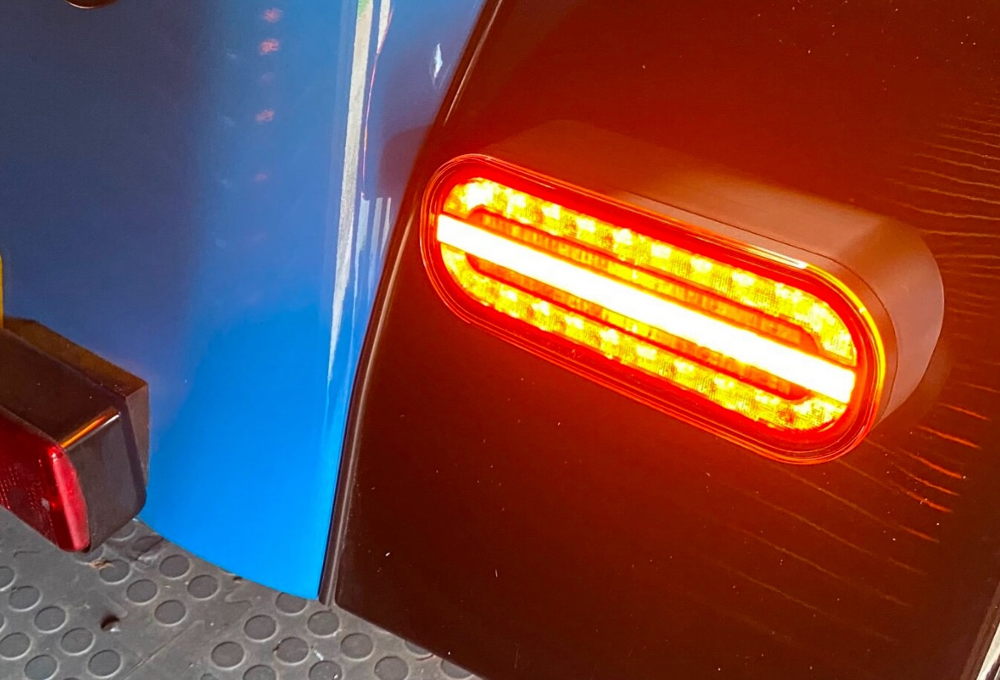
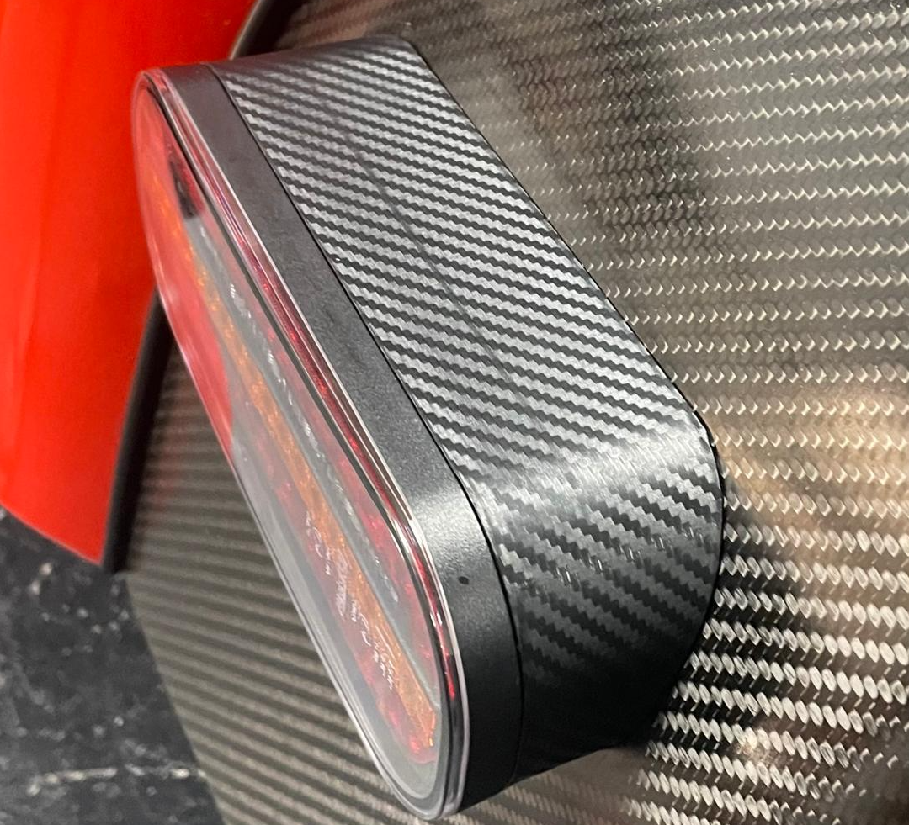

# BigCol's Flashy LED Lights

Caterham standard caravan rear lights are pretty terrible. Their LED versions are excellent, I have a pair, but they're currently £520. One of my friend's (BigCol) bought some of these: [here](https://fristom.com/en/offer/rear-lamps/ft-320-led/) which look great and have animated sequential indicators (video [here](https://www.youtube.com/watch?v=D6HZJRQdKpQ)). 
 and he wanted them to fit his car properly. so here is the solution.

## How much?
* I can supply the cowls & led lamps with the econoseal connectors fitted for £170 delivered which are drop-in replacements for the Caterham clusters.
Pay here: https://buy.stripe.com/4gMeVc6SXgF9c7I4jXbQY04

* I can also just send you the cowls and all the fittings for £90
Pay here: https://buy.stripe.com/7sY14m4KP3SngnY8AdbQY0a

## What are they like size-wise?
They're about the same size as the Caterham caravan lights. Here they are compared to the £520 version (which as slightly smaller). They're big enough to cover the holes from the original caravan lights, (unlike the 500 quid Caterham LEDs)
.

## How to fit them:
* unbolt the old lights removing the cables.
* reattach the grommets to the new lights.
* measure and drill two 10mm holes 90mm apart to the sides of the central hole. (use masking tape to get it all central and level)
* get some loctite ready
* fit the lights with the supplied nuts and bolts. make sure you get them the right orientation as the indicator is animated (small arrow on face points outwards, if you get it wrong, just undo the bolts and flip the light unit). The hex nuts attach the light to the cowl. then the wedge adaptors and the stainless washers then the flanged M6 bolts. use loctite on everything.
* reconnect the econoseals through the rear panel.
* go out and drive!

## Gotchas:
* as with any LED solution, you may need to replace your flasher relay with an LED relay if you've not done this yet and you may need to add a subloom to the indicator tell-tale if it has a common ground [here](https://www.classiccarleds.co.uk/products/diode-harness-kit-for-led-indicator-turn-signal-warning-light-fix-kit?_pos=1&_sid=4bf7c148f&_ss=r_)
* MOT requires a reflector which these units don't have, however the units ARE homologated for EU market.

## But I have a carbon-fiber fetish...
Ok, then wrap them in carbon vinyl:


