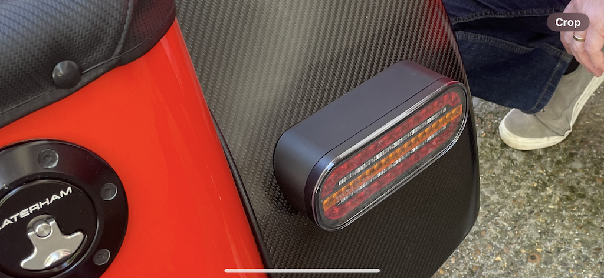
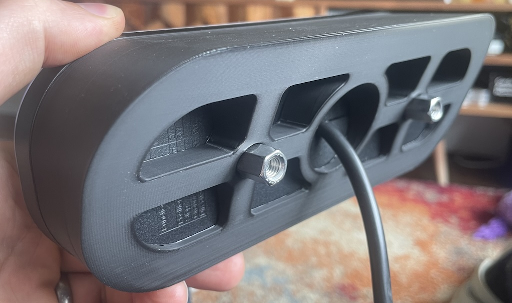
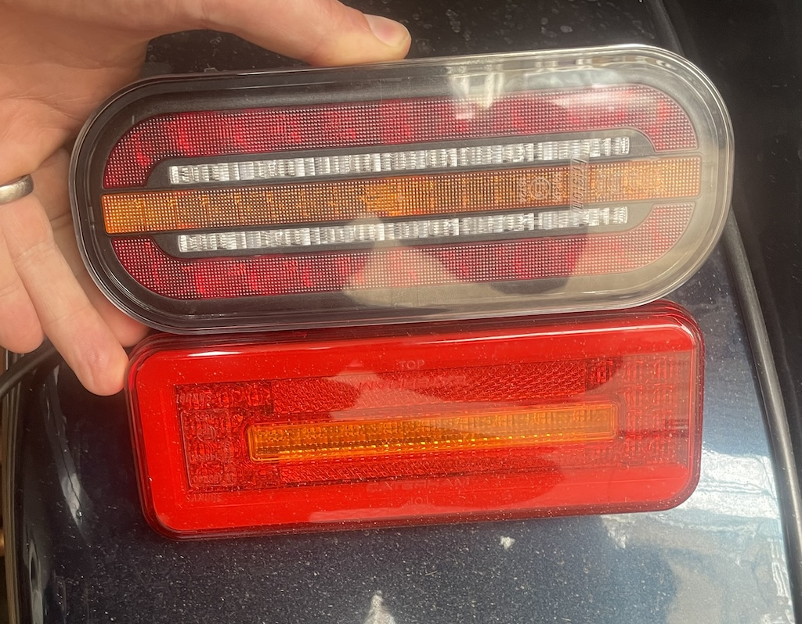
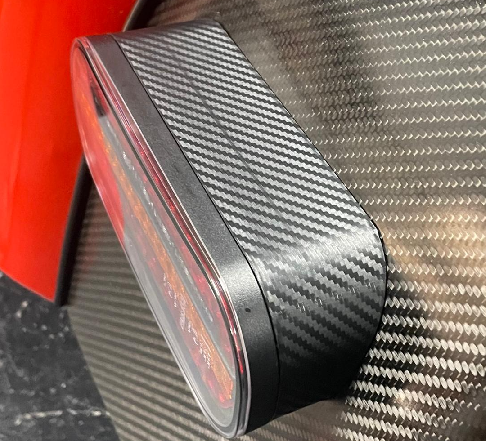

# BigCol's Flashy LED Lights

Caterham standard caravan rear lights are pretty terrible. the LED versions are excellent, I have a pair, but they're currently £520 and rarely in stock. one of my friend's (BigCol) bought some of these: [here](https://fristom.com/en/offer/rear-lamps/ft-320-led/) which look great and have animated sequential indicators (video [here](https://www.youtube.com/watch?v=D6HZJRQdKpQ)). 

## How much?
* The cowls alone are £80 including bolts and washers.
* lamp units from Bowers are about £75 delivered.
* I can supply just the cowls, or the the lights with the econoseal connectors fitted for £180 delivered 

## What are they like size-wise?
Here they are compared to the £520 version. they're big enough to cover the holes from the original caravan lights

## How to fit them:
* unbolt the old lights removing the cables.
* reattach the grommets to the new lights.
* measure and drill two 10mm holes 90mm apart (use masking tape to get it all central)
* fit the lights with the supplied nuts and bolts. make sure you get them the right orientation as the indicator is animated (small arrow points outwards). The hex nuts attach the light to the cowl. then the wedge adaptors and the washers then the flanged M6 bolts.
* reconnect the econoseals through the rear panel.

## Gotchas:
* you may need to replace your flasher relay with an LED relay if you've not done this yet.
* you may need to add a subloom to the indicator tell-tale if it has a common ground [here](https://www.classiccarleds.co.uk/products/diode-harness-kit-for-led-indicator-turn-signal-warning-light-fix-kit?_pos=1&_sid=4bf7c148f&_ss=r_)

## But I have a carbon-fibre fetish...
Ok, then wrap them in carbon vinyl:

To order,  [USE THIS FORM](https://forms.gle/DpTGsNrgPXGaVSZi8)


