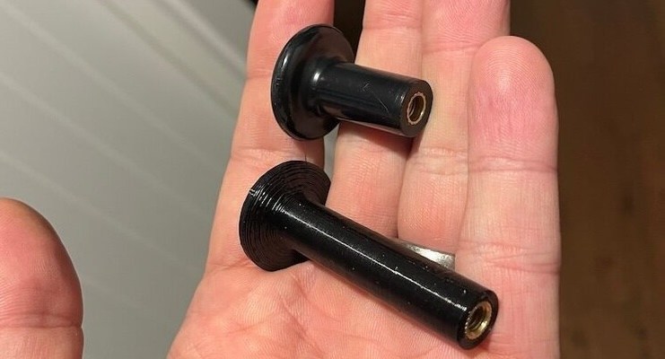

# Big Knob 

Can you pull your knob when you're in your strapped down tight?

no, me neither. having to loosen harness straps to turn the heater of is a PITA.

so I made myself a bigger knob. in fact, I've now got 2 knobs. a big (70mm) and an uber (100mm) for people with arms like a T-Rex.

they're made of PETG, so they'll take the heat under the dash, and they have a brass insert (just like the original) but they are much, much longer.

I can do a bunch of colours

£20 for either size + £4 p+p

<button onclick="checkout(this, 'PRICE_ID_PLACEHOLDER')">Buy – £20+P&P</button>


