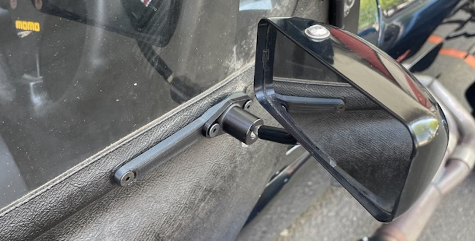
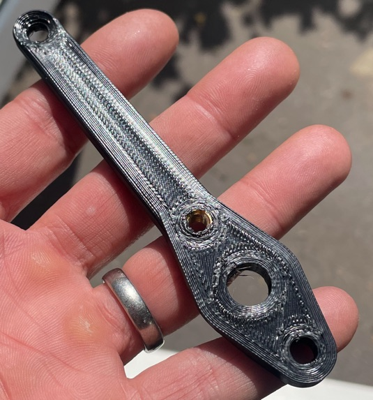

# Caterham to Spa/Motamec mirror adapters 

## The Problem.
Caterham's mirrors are terrible. Seriously. They're enormous and because they're not convex, you can't see anything. The original Eccles mounts are only attached at the hinge so are prone to shaking. 

## My solution
These adapters are a simple solution to allow a Spa or Motamec convex mirror to be fitted, which means you can change lane without just guessing if you're going to die.
they use a brass insert to give a strong anchor and the front bolt goes all the way through.  

## How much are they?
**£30 delivered

## How do I order?
<b>-->[use this form to order](https://forms.gle/e7RHGoqUPPPhi9fa9)<-- </b> I'll post them out. If you're happy, you send me the money, If you're not, return them.

## What comes in the kit?
* 2x adapters, Spa or Motamec fitting
* 2x 25mm M5 countersunk bolts 
* 2x 6mm M5 countersunk bolts 
* 2x 14mm M5 countersunk bolts 

## What do I need?
* 2x Spa/Motomec/CBS mirrors (buy the convex spa ones [here](http://www.kitcardirect.co.uk/spa-formula-f1-mirror.html) or the motamecs [here](https://www.motamec.com/motamec-racing-formula-f1-car-wing-mirror-x2-convex-glass-swivel-mount-black.html )
* 2x Side screens that have been drilled.
* 4x original nyloc nuts and washers from hinge and mirrors.

## Do you do different colours from black?
Yes! for £5 more I can do a colour that I have filament for (currently Orange, Red, Green, Grey, Blue). I can do others but cost will be more. I'm not guaranteeing colour tone.

**Any questions or anything else, contact me 7@uberniche.co.uk**