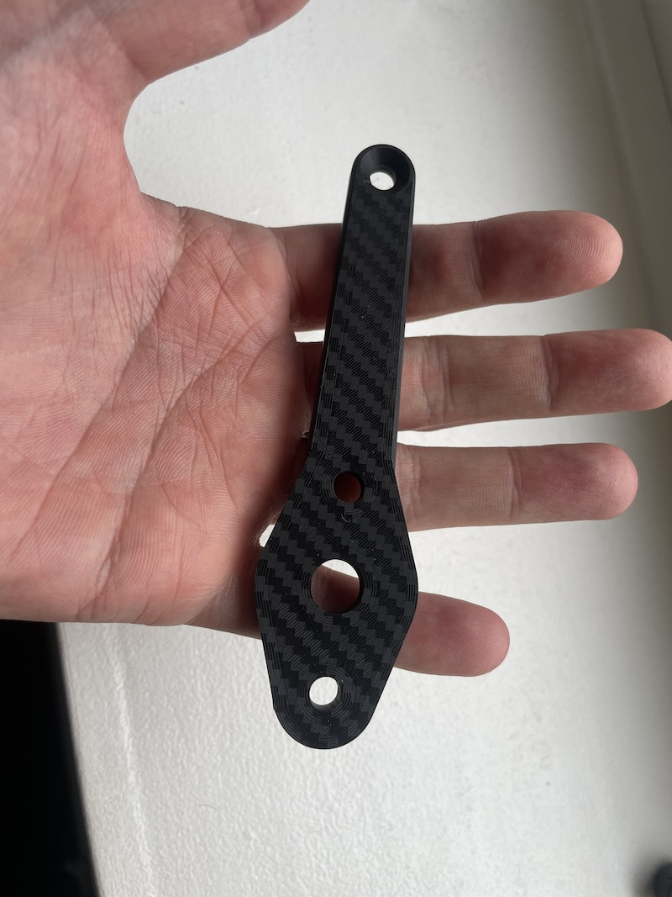

# Caterham to Spa & Motamec mirror adapters 

## The Problem.
Caterham's mirrors are terrible. Seriously. They're enormous and because they're not convex, you can't see anything. The original Eccles mounts are only attached at the hinge so are prone to shaking because of the leverage on the 10cm long part. 

## My solution
These adapters are a simple solution to allow a Spa or Motamec convex mirror to be fitted in the original holes of the caterham mirrors.
they use a brass insert to give a strong anchor and the front bolt goes all the way through.  

## How do they compare to my custom mirrors?
they're half the price and no measuring needed! They attach nice and tightly. I think the custom ones are a little stiffer as they're braced in 2 dimensions but I doubt there's a lot in it.
The original Caterham hinges allow the doors to open too far so that the mirrors are constantly hitting the screen and so I can include a set of  for an extra £10.

## How much are they?
**£28 delivery but you pay when you're happy with them**
It is an extra 10 quid if you want the hinge replacement, these are compatible with [Quick Swap Windscreen Mirror Mounts](/windscreen-mirror-mounts.md) (bolts included).

## How do I order?
<b>-->[use this form to order](https://forms.gle/FJKRT4qnbn325dPs6)<-- </b> I'll post them out. If you're happy, you send me the money, If you're not, return them.

## What comes in the kit?
* 2x adapters, Spa or Motamec fitting
* 2x 25mm M5 countersunk bolts 
* 2x 6mm M5 countersunk bolts 
* 2x 14mm M5 countersunk bolts 
* 2x friction shims for Spa mirrors (if you're ordering spa mirrors) as found [here](https://uberniche.co.uk/other-stuff)

## What do I need?
* 2x Spa/Motomec/CBS mirrors (buy the convex spa ones [here](https://www.merlinmotorsport.co.uk/s/mirrors/spa-mirrors/spa-formula-and-caterham-mirrors) or the motamecs [here](https://www.motamec.com/motamec-racing-formula-f1-car-wing-mirror-x2-convex-glass-swivel-mount-black.html )
* 2x Side screens that have been drilled.
* 4x original nyloc nuts and washers from hinge and mirrors.

## Do you do different colours from black?
Yes! for £5 more.

