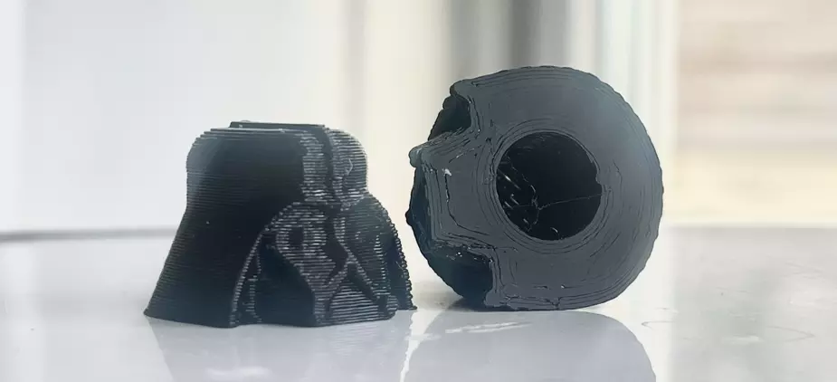

## Darth Schrader:
_"I find your lack of dust-caps disturbing"_
 
I HATE dust caps that you have to screw on your fingers get filthy so I just chuck em. These are push fit so miiiiiiiles better and
 
£12

<button onclick="checkout(this, 'PRICE_ID_PLACEHOLDER')">Buy – £12</button>

