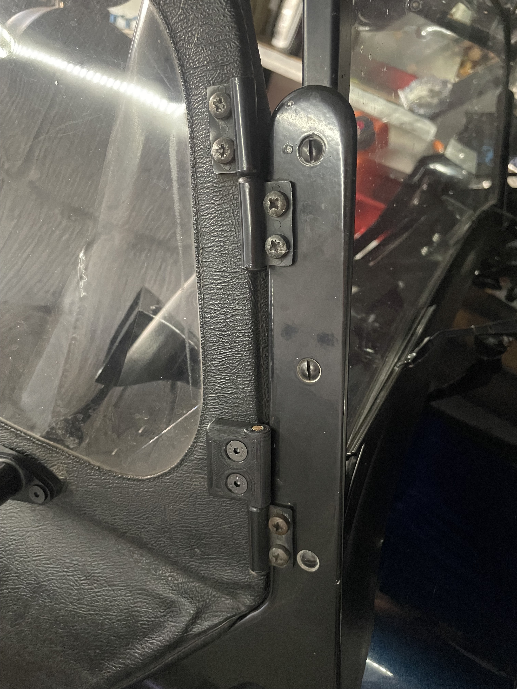
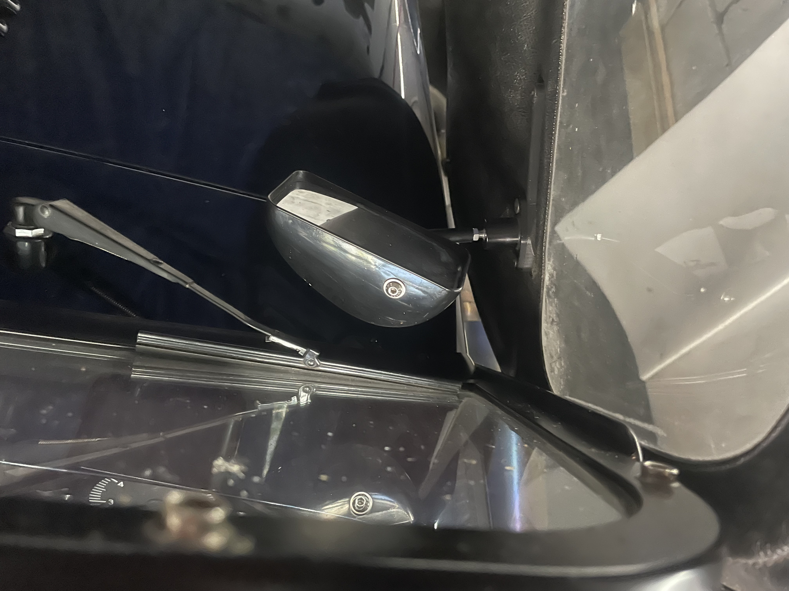

# Door Limiting Hinge

Do your door mirrors hit your windscreen when all the doors are open?
using Caterham hinges means that when your door opens too much so it will sit with the mirror hitting your windscreen. 
this means your mirrors are bumped every time you open your door fully.

I've designed some hinge replacements which limit the amount of opening so that the doors don't hit the windscreen.

£15 +£3 p+p for 1 pair, £25 for 2 pairs

To order [USE THIS FORM](https://forms.gle/5vtitZ7rHnNgAx4Y6) and **I can do various colours.**