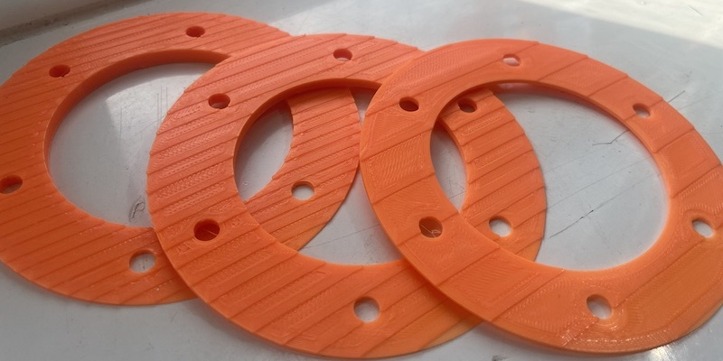
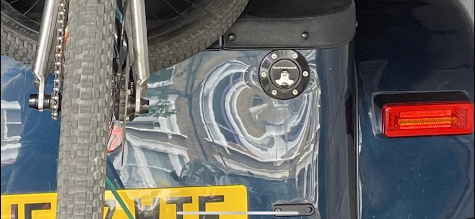
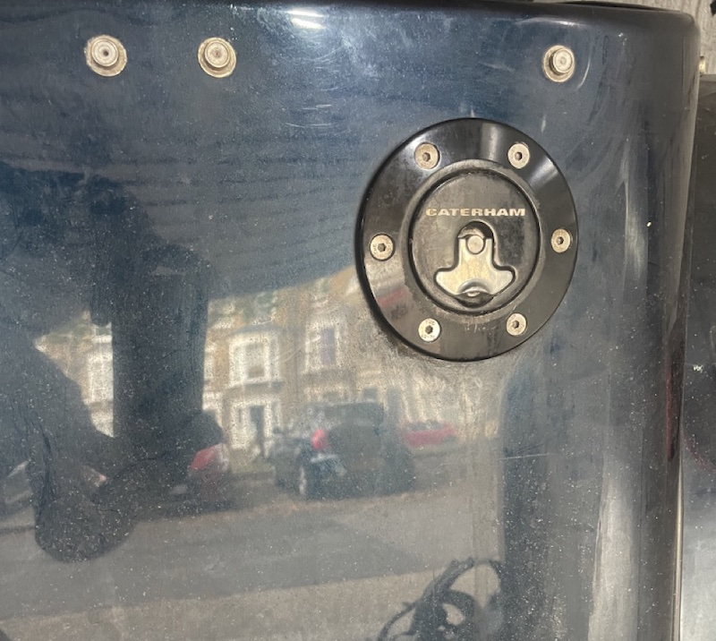

Fuel Filler Neck Shims

my fuel filler neck is not quite angled correctly and it warps the skin around it which makes it look a mess.

so I created some wedge shaped shims which are 2,4,6mm wide at one edge and 0.2mm at the other. these can then adjust the edge 2-12mm outwards to fix the misaligned fuel filler cap.
they fit between the filler neck and the rear skin and so can't be seen and the rubber seal should still seal the filler cap. 

on my car, the end result is much better (yes, it desperately needs a clean):

£25 + £3 P&P

<button onclick="addToBasket('price_1TIxqHAhb23PF7gKjjYbMlh9', 'Fuel Filler Neck Shims', 25)">Add to basket – £25 + £3 P&P</button>

