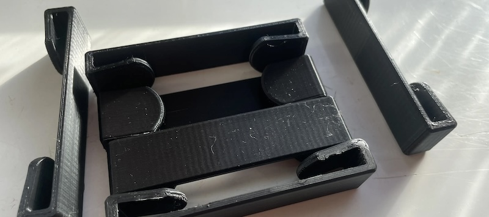
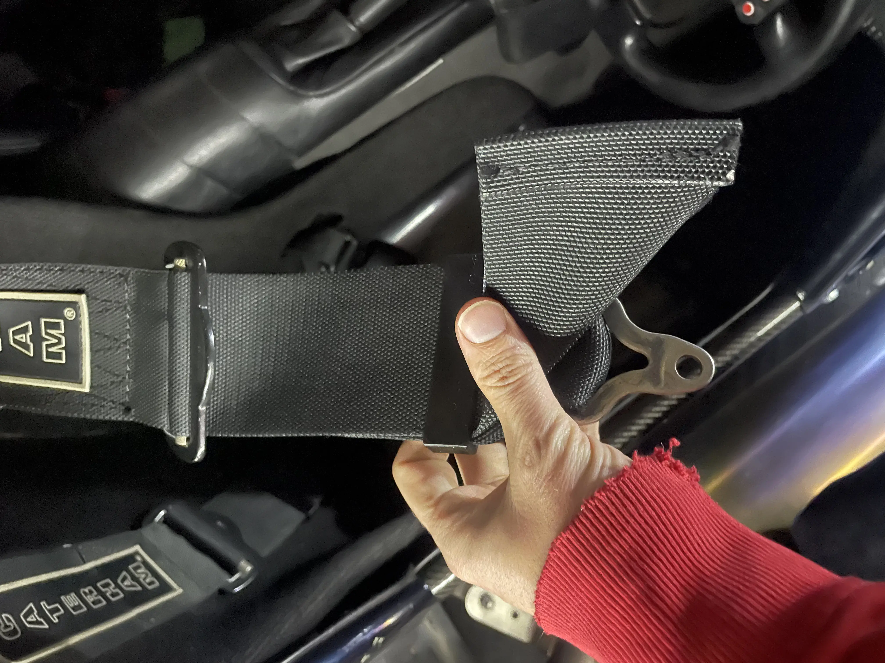
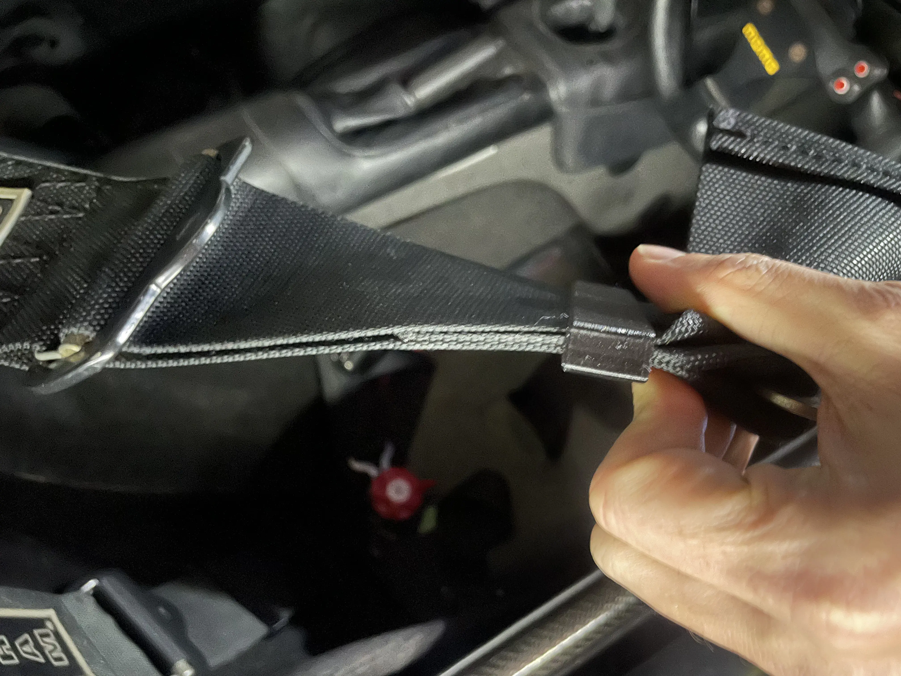

# Harness-Strap clips

Do your harness straps flap about in the wind and annoy you? they certainly annoyed Colin so he asked me to make these!
 
originally a bright idea by Colin to replace binder clips, these are printed in PETG to resist the sun and heat, and are designed to be a tight fit on the harness straps.

these fit the standard Caterham (Luke?) 3" harness top straps. simply bend the straps to get them in, and then slide them down to clamp the straps. they are designed with arms that pinch the straps and with teeth in the arms that will hold nice and tight.

£10 for drivers pair, 15 for both +£3 p+p

To order,  [USE THIS FORM](https://forms.gle/5vtitZ7rHnNgAx4Y6) and **I can do various colours.**