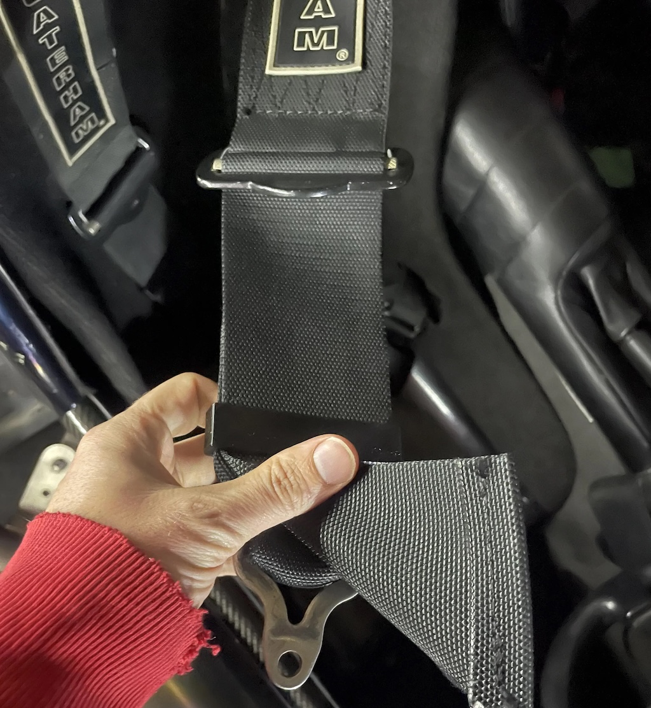
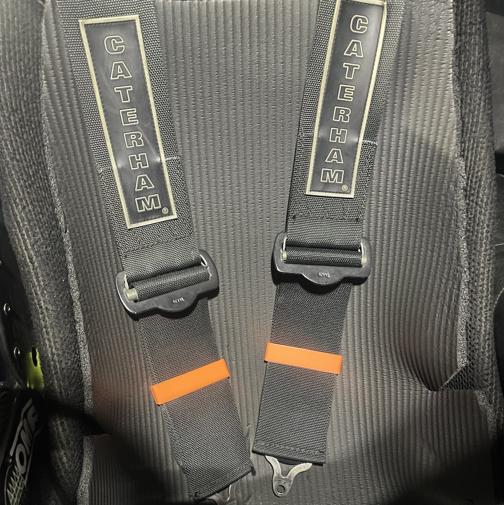

# Harness-Strap clips

Do your harness straps flap about in the wind and annoy you? They certainly annoyed my friend Colin, so he asked me to make these!
 

I can also print them in multiple colours (not all shown here) in PLA. The PLA can bow slightly  if sat in direct sun in a stationary car for hours, but they can be straightened out with a hairdryer. (I ran them for most of the summer with no problem, Colin's bowed a little)
I can also print them in black PETG to resist the sun and heat.

They tightly fit the standard Caterham (Luke?) 3" harness top straps. simply bend the straps to get them in, and then slide them down to clamp the straps. they are designed with arms that pinch the straps and with teeth in the arms that will hold nice and tight.

£15 for drivers pair, 20 for both + £3 p+p

To order,  [USE THIS FORM](https://forms.gle/DpTGsNrgPXGaVSZi8) and **I can do various colours.**


