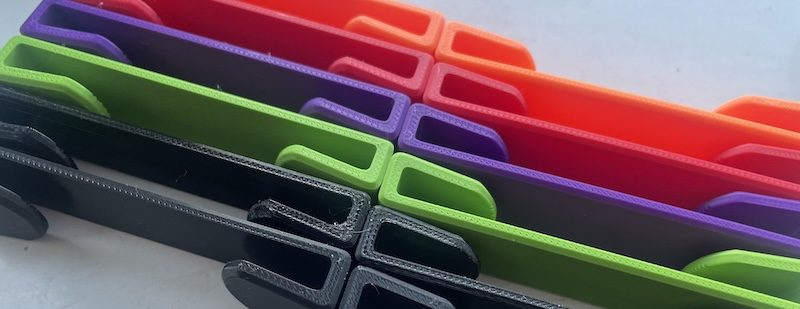
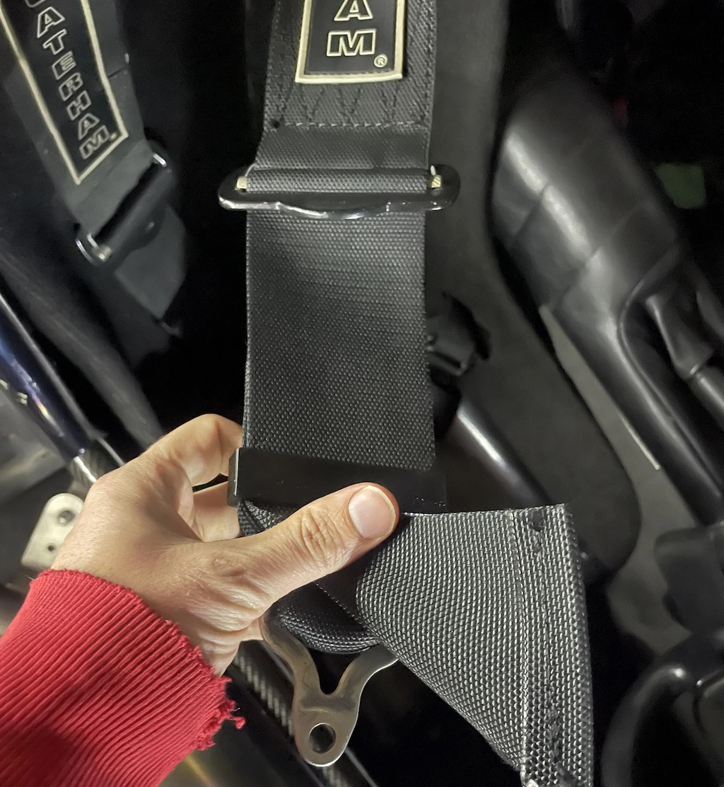
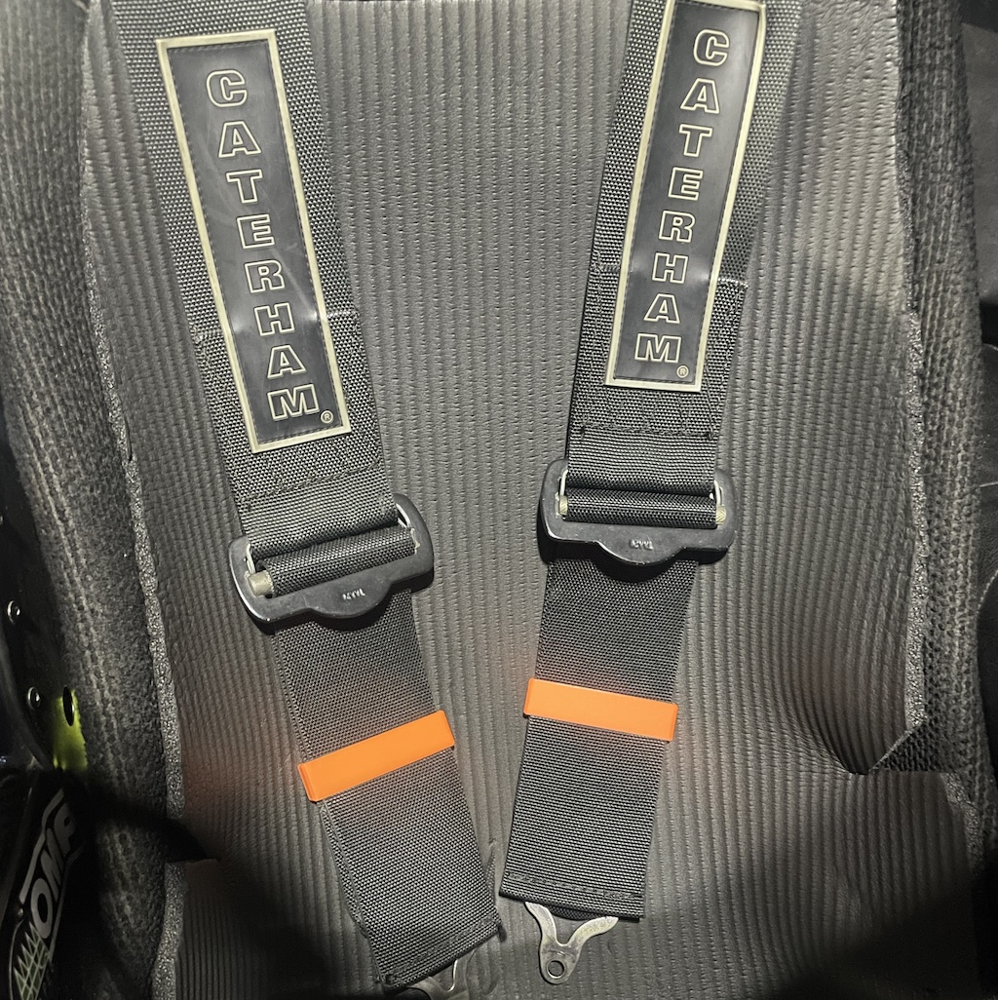

# Harness-Strap clips

Do your harness straps flap about in the wind and annoy you? They certainly annoyed my friend Colin, so he asked me to make these!
 

I can also print them in multiple colours (not all shown here) in ABS. +3 quid for non-black 

They tightly fit the standard Caterham (Luke?) 3" harness top straps. They are designed with arms that pinch the straps and with teeth in the arms that will hold nice and tight.

£25 + £4 P&P (+£3 for different colours)

<button onclick="addToBasket('price_1SPU67Ahb23PF7gKUp5OYxAd', 'Harness Strap Clips', 25)">Add to basket – £25 + £4 P&P</button>

please note, the finish of this has to be flat as pictured, not carbon-fibre effect.  


