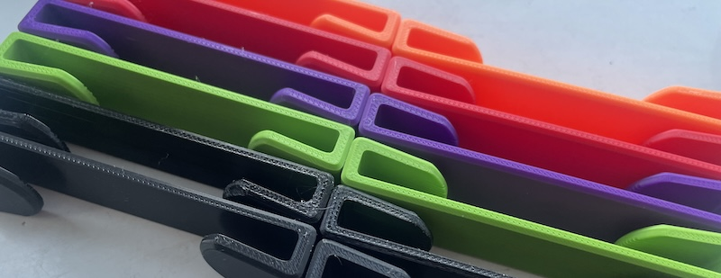

# Harness-Strap clips

Do your harness straps flap about in the wind and annoy you? They certainly annoyed my friend Colin, so he asked me to make these!
 

I can also print them in multiple colours (not all shown here) in PLA or black in PETG. 

They tightly fit the standard Caterham (Luke?) 3" harness top straps. simply bend the straps to get them in, and then slide them down to clamp the straps. they are designed with arms that pinch the straps and with teeth in the arms that will hold nice and tight.

£20 for drivers pair, 25 for both + £3 p+p

To order,  [USE THIS FORM](https://forms.gle/DpTGsNrgPXGaVSZi8) and **I can do various colours.**

please note, the finish of this has to be flat as pictured to keep strength in the clips. printing them to have a carbon/patterned would make them super weak. 


