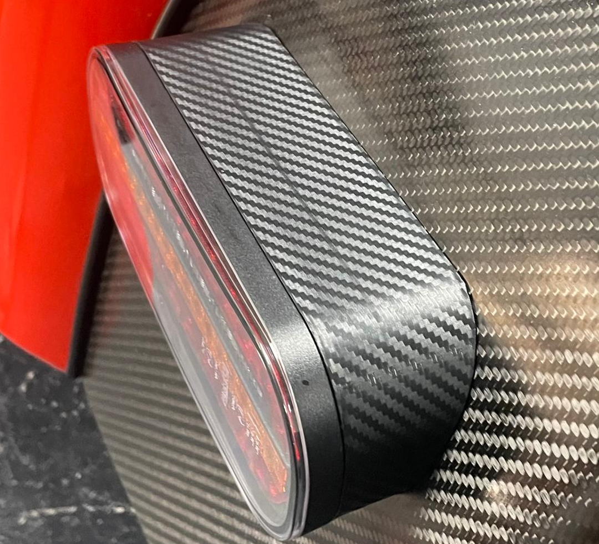

# Yellow_Super_Seven's Flashy LED Lights for Westfields

Westfield's standard caravan rear lights are pretty terrible.  After seeing the caterham replacements I make, Ian [Yellow_Super_Seven](https://www.instagram.com/yellowsuperseven/) wanted some that would fit the flat part of his Westfield's wing and here they are

## How much?
* I can supply the cowls & led lamps with the econoseal or bullet connectors fitted for £140 delivered which are drop-in replacements for the caterham clusters. 
* if you're outside of the UK I can help you find the LED lamps locally and just send you the cowls and fittings for £50

## What are they like size-wise?
They're about the same size as the westfield caravan lights, but they have a cut-away to fit the edge of the westfield wing

## How to fit them:
* unbolt the old lights removing the cables.
* reattach the grommets to the new lights.
* measure and drill two 10mm holes 90mm apart to the sides of the central hole. (use the gasket or masking tape to get it all central and level)
* get some loctite ready
* fit the lights with the supplied nuts. make sure you get them the right orientation as the indicator is animated (small arrow on face points outwards, if you get it wrong, just undo the bolts and flip the light unit). use loctite on everything.
* reconnect the econoseals or bullet connectors through the rear panel.
* go out and drive!

## Gotchas:
* you will need to replace your flasher relay with an [LED relay](https://www.amazon.co.uk/dp/B07RN81QGH) if you've not done this yet. 
* you may need to add a subloom to the indicator tell-tale if it has a common ground [here](https://www.classiccarleds.co.uk/products/diode-harness-kit-for-led-indicator-turn-signal-warning-light-fix-kit?_pos=1&_sid=4bf7c148f&_ss=r_)
* MOT requires a reflector which these units don't have, however the lamp units ARE homologated for EU market. but realistically, who is going to notice or care.

## But I have a carbon-fiber fetish...
Ok, then wrap them in carbon vinyl:

## How to order:
To order,  [USE THIS FORM](https://forms.gle/DpTGsNrgPXGaVSZi8) pick westfield LED


