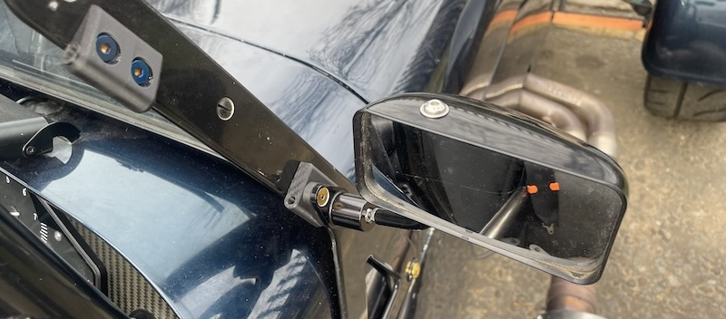

#  

I make and design improvements for my Caterham 7 which I have tested from the Nurburgring to Cadwell Park and the Stelvio pass. All profits are spent on super-unleaded and R888Rs. 

You can find me on [Instagram](https://www.instagram.com/uber.niche/) and [Youtube](https://www.youtube.com/@GraeArea) 

# Mirrors
[Lifeline Mirror Mounts](/lifeline-mirror-mounts.md) - solidly attach convex adjustable mirrors to any sidescreen

[Quick Swap Windscreen Mirror Mounts](/quick-swap-mirror-mounts) - quickly switch attach mirrors between sidescreens and windscreen mounted for driving with no doors.

[Mirror Adapters](/caterham-spa-adapters) - adapts Caterham bolt holes to Spa or Motamec mirrors

[Mirror Mounts](/mirror-mounts) - super-stiff and fit to the holes of your old mirrors.

[Motorsport Mirror Mount](/momimo) - small, light, cheap and strong attachment to your rollcage

# Pedals
[Large Pedal Extension](/large-pedals) - to assist with Heel-and-Toeing and comfort

[Pedal Extension Plugs](/pedals) - to assist with Heel-and-Toeing

# Interior
[Harness Strap Clips](/harness-strap-clips) - Stops your straps flapping about

[Big Knob](/big-knob) - longer heater knob for easier reaching

[Lapbelt Bung](/lapbelt-bung) - Fills the hole of your chassis for the lap belt

# Phone mounts
[Apple Magsafe Mount](/magsafe) - uses the magic of magnets to securely hold a phone.

[Maglock Mount](/maglock) - uses the magic of magnets to securely hold a phone.

[Quadlock Mount](/quadlock) - attaches to your existing scuttle holes

# Led Brake Lamp Cowls
[Rear LED Cluster](/big-col-flashy-lights) - Bright drop-in replacement for Caterham's caravan lights     

[Rear LED Cluster For Westfields](/ben-westie-flashy-lights) - Bright drop-in replacement for Westfield's caravan lights     

[Fuel filler neck wedge shims](/fuel-neck-shim) - small, light, cheap and strong attachment to your rollcage

# Others
[Aeroscreen Stuff](/other-stuff) - aero shims, etc

[Beer Can Clip](/jamaican-bacon) - attaches beer cans to your bike or roll-cage

[Darth Schrader](/darth) - push-on dust caps

[//]: # ([Hi Level Brake Light Mounts]&#40;/hi-level&#41; - High Level univesal brake mounts )

[//]: # ([![Hi Level Brake Light Mounts]&#40;img/hi-level.webp&#41;]&#40;/hi-level&#41;)

[//]: # ([Self Cancelling Indicators]&#40;/self-cancelling-indicators&#41; - a bit of fun, not for sale as it's too much soldering)

[//]: # ([![Self Cancelling Indicators]&#40;img/d&#41;]&#40;/self-cancelling-indicators&#41;)

