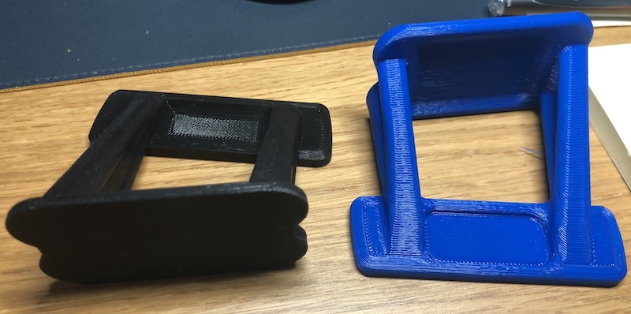

# Magsafe Phone Mount for iPhone

 it uses 3M VHB tape to fix to the scuttle. this can be removed cleanly using dental floss, but otherwise it is going nowhere.

[Video here of what it looks like](https://youtu.be/bOc9bqDt7ds)
Video here from the Karussell. if that doesn't make your phone drop off, nothing will. click on it:

£25 +£3 p+p +3 for non-black colours

<button onclick="addToBasket('PRICE_ID_PLACEHOLDER', 'Magsafe Phone Mount', 25)">Add to basket – £25+P&P</button>

