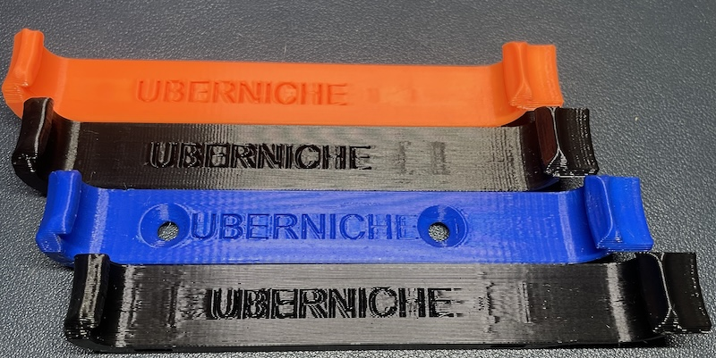

# Jamaican Bacon Clip

photo of multiple on the bike
 

The Jamaican Bacon Clip
- Precision quick release clip for post-trail-line smashing
- Tested and proven to cope with riding Sheet trails and Sandwich trails
- Fits standard bottle cage mounts.
- Can also accept dual zipties and/or vhb tape.
- comes with a strip of VHB to stop it moving about laterally whilst the zipties take the weight
- rear is curved to fit snugly to 34mm tube but will happily cope with BMX tube dia or slightly bigger.
- secure hold of your favourite 330ml/440ml drink (n.b. Guinness cans are weird sized due to widget.)
- I can do any colour that I have the filament for, so just ask
- if you say "bacon" in a Jamaican accent ...

how secure is it?
this is midair over sheet trails last jump which has a 6 foot takeoff:

which is from this video:
<iframe width="560" height="315" src="https://www.youtube.com/embed/Dp522QPF-HY?si=Jwde1ShAq1-ExYmz" frameborder="0" allowfullscreen></iframe>

First time I finished the line, I smashed a beer! 

so decide:
- with or without bottle boss holes
- colour
- 330: £12 + £3 p&p
- 440: £14 + £3 p&p

discount for multiples (including delivery):
- 1=£15
- 2=£25
- 3=£33
- 4=£39

To order [USE THIS FORM](https://forms.gle/5vtitZ7rHnNgAx4Y6) and ** remember, I can do various colours.**
