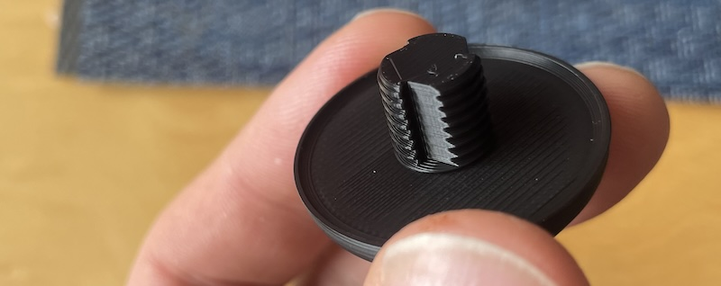
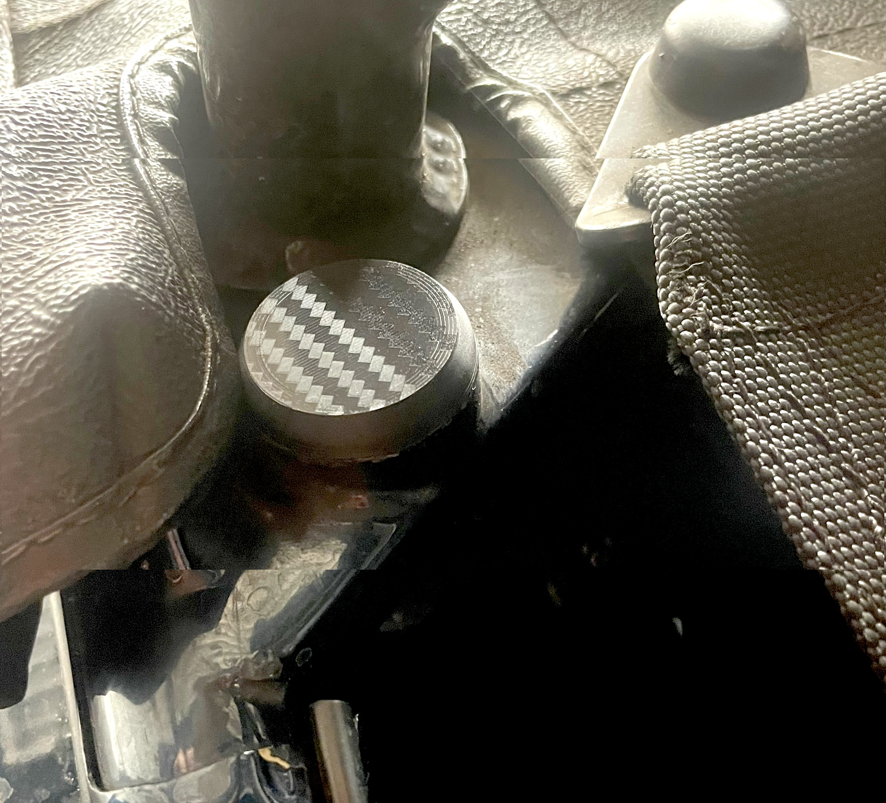
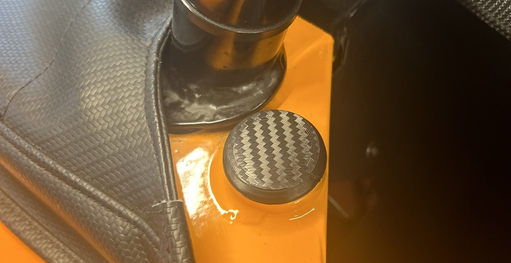

# Lap-belt Bung

A nice bung which covers the grot trap of an ugly lapbelt hole and is now printed out of Carbon-Fibre ASA.  

Have I got good news for you!

The threads have cuts to clear out grot as you screw it in. 
screw it gently in a couple of times to clear the thread then just tweak it up and don't overtighten it and it should stay where it is for years to come as the plastic is pretty solid. you can always loctite it if needed. 

£12 + £3 P&P

<button onclick="addToBasket('price_1RT2geAhb23PF7gKoUtoSgRb', 'Lap-belt Bung', 12)">Add to basket – £12 + £3 P&P</button>


