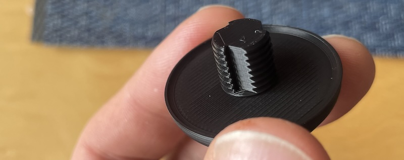

# Lap-belt Bung

what was that? 

You want a bung to neaten up the hole of your lap belt boss, but it's full of grot?

So the bung needs to tap the thread into the grot and clean it out?

it shouldn't be ugly, maybe a nice carbon fibre weave appearance?

you don't care if it's billet aluminium and you don't want it to cost £40?

Have I got good news for you!

The threads have cuts to clear out grot as you screw it in. 
screw it gently in a couple of times to clear the thread then just tweak it up and don't overtighten it and it should stay where it is for years to come as the plastic is pretty solid. you can always loctite it if needed. 

£15 delivered

To order,  [USE THIS FORM](https://forms.gle/DpTGsNrgPXGaVSZi8)


