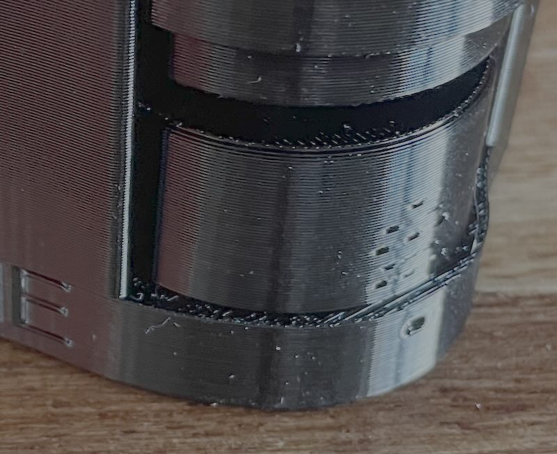

# Large Pedal Extension

## Pedal Extensions to improve heel-and-toeing and comfort
These are 3D printed extensions that will fit into your Caterham's pedal to make it wider so that you can more easily "heel and toe". This is especially difficult in SV chassis cars where the gap can be up to 75mm.

As the accelerator is extended downwards and sideways, they make it easier to twist your foot to hit the accelerator pedal whilst hard on your brake. They come in different sizes to bridge the gap between the your foot whilst on the brake and accelerator.

I've done close to 10,000 miles including a trip to the nurburgring, a dozen or so trackdays and various tours.

In my S3 chassis I have a 45mm gap in which I use a 10mm plug and in my size 8 driving boots, it's perfect. 35mm seems pretty good to me and is about 1/3 of the width of my foot.

To stop the pedal extensions rotating, they have a notch to increase the friction fit and if they still twist, there is a marking on the back of the pedal for drilling a hole for a small self-tapping screw, but a bit of loctite should be more than enough.

I've been running them a few years and they've been great. 

## how do I order?

measure the distance between your brake and your accelerator?  

* for an S3 chassis, I recommend a 10 or 15mm extension.
* for an SV chassis it is extremely variable. you need to tell me what you want, and I'll send you a 20 or 30 or something similar

## How much are they?
£45 delivered 
if you want 2 or more sizes, it's £10 for each extra. if you ordered one size but want to go up/down a size, I'll send you a replacement for a tenner.

## For orders, please [Use this Form](https://forms.gle/Bi147cGau4G2gFRY8)
any problems email john@uberniche.co.uk

## Fitting
**Firstly, this is easiest with the pedal off, (lasty time I fitted these at snetterton, it was s a 30-minute job in total):**
* Undo the top of the pedal box (6 screws and one bolt (on mine))
* Detach the throttle cable
* Undo the bolt of the accelerator pivot (13mm open spanner)
* Remove pedal
   
  
   

**Fit into the pedals**

*USUALLY, you can push it together and then stand on the pedal sideways to force the two halves together.
* NB. All pedals on Caterhams are _slightly_ different so there _might_ need 5 minutes of filing for it to fit.
* If you struggle getting them in, try spinning them a bit. the plugs are slightly oval as many pedals are oval.
* If they still won't fit, find the spot where they almost go in and then file a little off the widest part of the insertion part on opposite sides of the plug like this:
   
  
   
* (note the printing pattern of the part is not indicative of the wide bit)
* First press the main pedal part into the left side. This should go in with a bit of a shove or smacking it with a rubber mallet.
* Refit the pedal back in the car and loosely tighten the pivot bolt back up. 
* Push the accelerator all the way down to the stop. get back out and **make sure that the bottom of the pedal isn't contacting the firewall and that it is stopping on the metal pedal body**. rotate the pedal away from the firewall if needed. 
* Remove the pedal again from the footwell.
* Press fit the 8mm plug into the right hand side. This should again go in with a bit of a shove.
* Once they're both in, put the bolt through the hole, DON'T overtighten. if you hear cracking noises, stop! you're right there.
* depending on how tight a fit your pedal is, there is an indent on the main pedal body where it is massively reinforced so that you can drill a tiny pilot hole and fit a short self tapper into it as can be seen here: 

**Refit your pedal**

### FAQ
- How strong is it?
  - Strong enough. You're not driving a transit van in steel toecaps, you're wearing ballet shoes. they're printed with a honeycomb infill and 6 layers of PETG walls. tap them, they sound high-pitched cos they're so stiff. I've had no-one return one yet.
- What happens if it snaps and I crash my car
  - This product is used entirely at your own risk. again, it's not your brake pedal.
- I don't want to take my pedal out.
  - If you cut down an allen key you can just about get in there to fit it. I've done it twice, but it's a pain in the shoulder. Seriously, just take the pedal out for the fitting.
- I think it's rubbish, I want my money back.
  - OK, send it back, and I'll refund you.
- I want a custom colour.
  - OK. It'll cost you another £3
- I want a custom size width or height
  - get in touch
- I want to give you some feedback
  - please do! just email me at john@uberniche.co.uk I especially like pictures of customers pedals fitted and to know what size they fitted.

