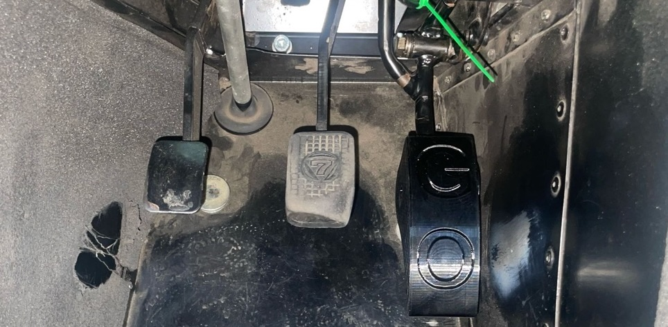

# Large Pedal Extension

## Pedal Extensions to improve heel-and-toeing and comfort
These are 3D printed extensions that fit into your Caterham's pedal to make it wider so that you can more easily "heel and toe". This is especially difficult in SV chassis cars where the gap can be up to 75mm.

The extensions are extended downwards and are wider which makes it easier to twist your foot to hit the accelerator pedal, especially whilst hard on your brake. They come in different sizes to bridge the gap between the your foot and accelerator.

I've done close to 20,000 miles including trips to the nurburgring, the alps and dozens of trackdays and drift days.

In my S3 chassis I have a 45mm gap in which I use a 10mm plug and in my size 8 driving boots, it's perfect. 35mm seems pretty good to me and is about 1/3 of the width of my foot.

To stop the pedal extensions rotating, they have a notch to increase the friction fit, but some loctite won't hurt

for an S3 chassis, I recommend a 10 or 15mm extension. for an SV chassis I'd recommend a 20 or 30 or something similar. put your foot on the brake pedal and judge the gap to your pedal.

## How much are they?
£45 if you want extra sizes, it's £10 for each extra. 

## [ORDER HERE](https://buy.stripe.com/cNifZga59dsX2x8aIlbQY03)
any problems email john@uberniche.co.uk

## Fitting
* Fit the cap into the right hand side of the pedal (gogo-gadget arms help here)
* fit the main part of the pedal to the left side, slide the bolt into it. 
* squeeze the pedal together and slide the bolt in. 
* tighten the bolt and it should pull the two halves together but don't tighten it yet.
* adjust the pedal angle so that you can push the pedal fully down and it isnt hitting the firewall
* tighten the bolt. once you hear cracking noises, stop. it should be very firmly fit now. if not, tighten some more.
* if it doesn't go together you could use something to squeeze it together like an irwin grip or big channel pliers. 
* if this doesn't work you may need to remove the pedal which isn't a difficult job but will add a good half hour. the pedals sometimes ovalise with use and need a mallet to get the plugs into it. if you damage a plug fitting it, just get in touch and I'll send you another. 

### FAQ
- How strong is it?
  - Strong enough. You're not driving a transit van in steel toecaps, you're wearing ballet shoes. they're printed with a honeycomb infill and 6 layers of PETG walls. tap them, they sound high-pitched cos they're so stiff. I've had no-one return one yet.
- What happens if it snaps and I crash my car
  - This product is used entirely at your own risk. again, it's not your brake pedal.
- I think it's rubbish, I want my money back.
  - OK, send it back, and I'll refund you.
- I want a custom colour.
  - OK. It'll cost you another £5
- I want a custom size width or height
  - get in touch
- I want to give you some feedback
  - please do! just email me at john@uberniche.co.uk I especially like pictures of customers pedals fitted and to know what size they fitted.

