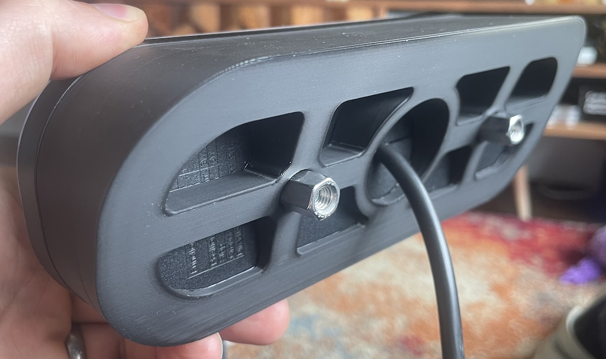

# Cowl for LED lights 

Caterham standard rear lights are pretty terrible. the LED versions are excellent, I have a pair, but they're currently £520 and rarely in stock. one of my friend's bought some of these: https://fristom.com/en/offer/rear-lamps/ft-320-led/ which look great and have that animated indicator look. 

Unfortunately, mounting them onto the rear of a caterham will have them pointing to the sky. so he asked me to make some cowls to fit the cluster units to the rear wings   

# How do they fit
* Buy some of the lights above.
* measure the angle of the back of the cowl, best done with a digital angle meter, or your phone using an app. (The standard caterham ones are 20 or 30deg) I can then make up the cowls for you, I make 20deg or 30deg
* the cowls need holes drilling in the wings for the bolt extenders of 12mm. this is best done with a step drill bit.
* fit econoseal connectors to the led lamps.  
* plug it all up.

To order,  [USE THIS FORM](https://forms.gle/DpTGsNrgPXGaVSZi8)


