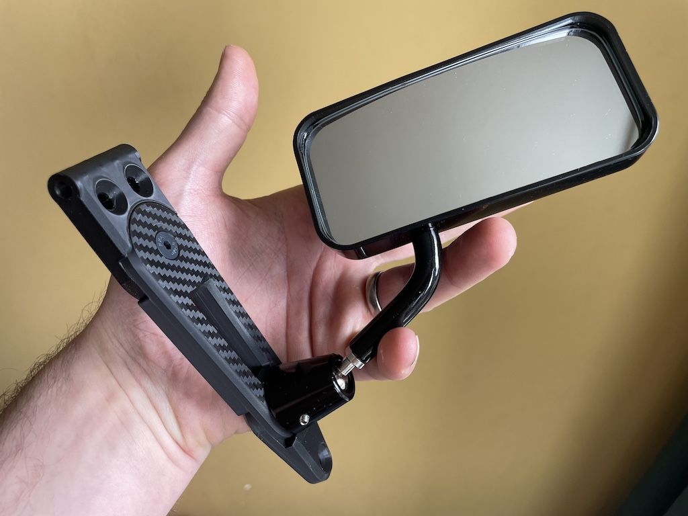
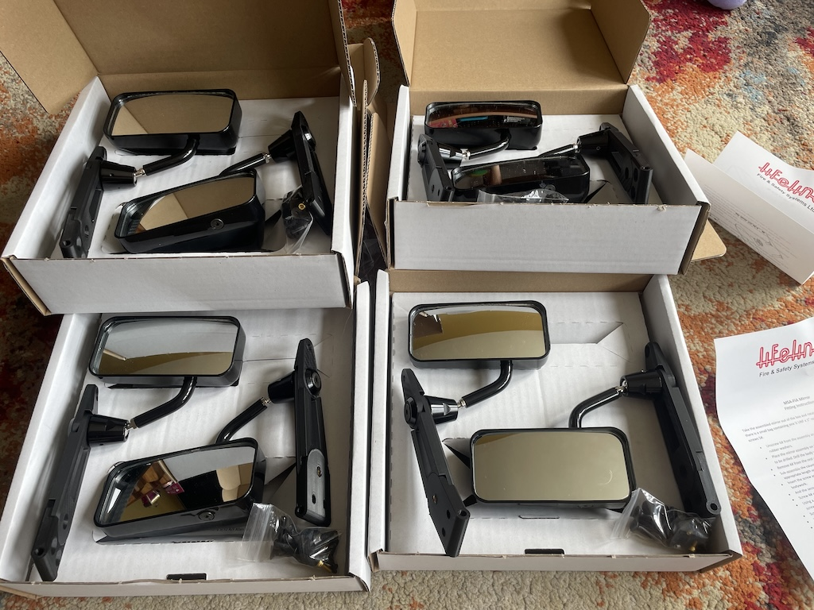

# Lifeline Mirrors and adaptors 

## The Problem.
* Caterham's mirrors are terrible. Seriously. They're enormous and because they're not convex, you can't see anything. The original Eccles mounts are only attached at the hinge so are prone to shaking because of the leverage on the 10cm long part.
* Spa Mirrors have a pretty crappy mount that is not easily adjustable without entirely removing the mirror. I do offer some friction cups that help with this, but it's still internal adjustment.
* Motamec Mirrors are not very convex at all which makes them useless, but at least have a grub-screw to tighten mirror in place. They have "Objects in the mirror are closer than they appear" written on them. 

## Lifeline Mirrors
They are convex, externally adjustable, very sturdy and have short arms. The large M6 Bolt they use for stability means they won't go through the existing holes in the doors. They unfortunately come with an imperial size 4 grub screw which is absolutely tiny and no-one has the hex key for.

## My Solution
I've designed some very stiff, _articulated_ mirror mounts that can fit the myriad dimensions of holes in Caterham side-screens. They have 2 pivots and can span a large range which should fit any set of side screens. the mount also stops the mirrors from clouting the windscreen when you open the door.

I've modified Convex Black Lifeline mirrors and replaced the imperial grub screws with M3 grub screws which are much bigger stronger and are a standard metric hex size.

## How much are they?
£140 including delivery for everything, modified mirrors, mounts and all bolts. (mirrors from elsewhere will cost around 60quid delivered)
£70 including delivery for the mounts.
if you want different mirrors from Lifeline, I can get them for you, but I'll need to give you a price.

## How do I order?
<b>-->[use this form to order](https://forms.gle/athdrwR55KYqTNVB6)<-- </b>

## What comes in the kit?
* 2x black MSA convex mirrors modified with larger M3 metric grub screws and caphead bolts
* 2x articulated mounts
* 6x 20mm M5 countersunk bolts
  

## What do I need?
* 2x Side screens that have been drilled for caterham mirrors.
* 6x original nyloc nuts and washers from hinge and mirrors.
* loctite

## Fitting instructions
* remove your hinge
* unscrew the outer fitting of the base
* offer up the articulated mount to the sidescreen and push the bolts through to line it all up. You can fit the small screw in the pivot (loctite it!) now tighten up the inner part of the base. you can tighten up the inner part of the base using a spanner. if it spins, take it off and tighten, being careful to not move the parts. this can be tightened tightly.
* refit the outer with the mirror. you can tighten down the mirror with a 19mm spanner until the mirror is nice and tight but still adjustable. once you have this tight enough, screw in a grub/caphead screw to lock the mirror in place. don't over-tighten this as it's only aluminium and will strip.

