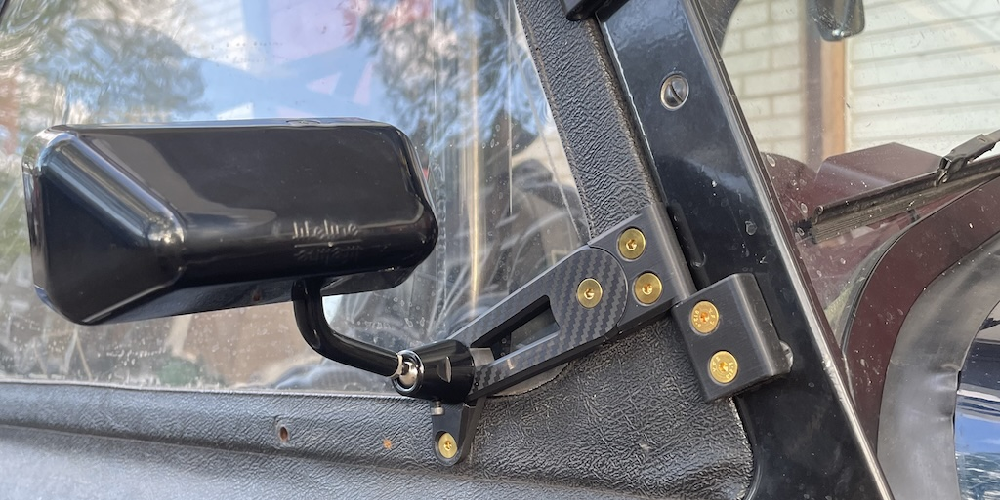
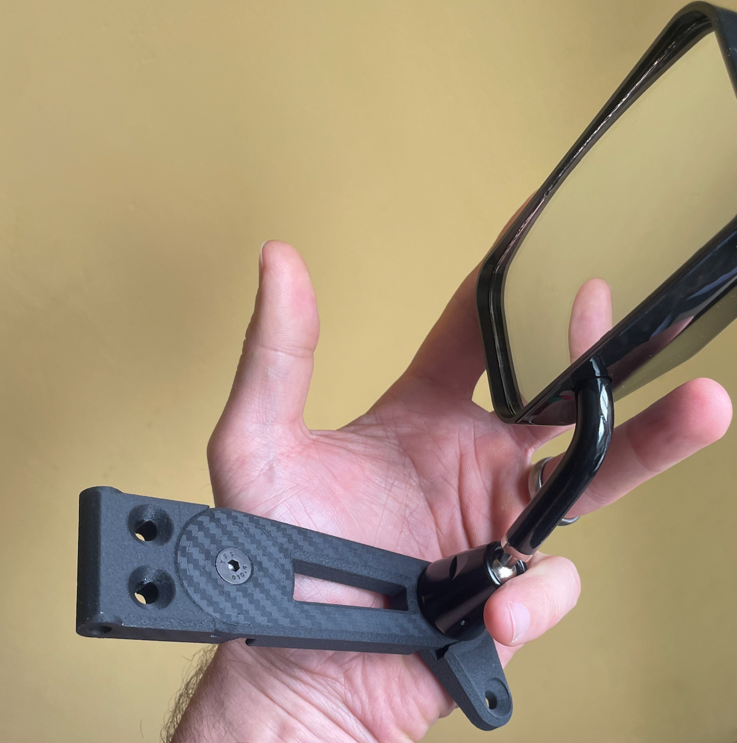

# Lifeline Mirrors with Carbon-fibre-reinforced Brackets 

* Caterham's mirrors are terrible. They're enormous and because they're not convex, you can't see anything. The original Eccles mounts are only attached at the hinge so are prone to shaking because of the leverage on the 10cm long part.
* Spa Mirrors have a terrible mount that is not adjustable without entirely removing the mirror. I do offer some friction cups that help with this, but it's still an internal adjustment.

### Lifeline Mirrors

They are convex, externally adjustable and have short arms. The large M6 Bolt they use for stability means they won't go through the existing holes in the doors.

### Brackets

These stiff, _articulated_ mirror mounting brackets can fit the myriad dimensions of holes in Caterham side-screens. They have 2 pivots and can span a large range which fits any side screens. The mounts also stop the mirrors from clouting the windscreen when you open the door.

if you have Spa Carbon Fibre Mirrors, you can buy the option below with Lifeline Bases Only, then unscrew your current crappy base from the Spa and screw it into the new Lifeline one for excellent adjustability and security. no more removing the whole thing to adjust the tension.

If you want Spa Carbon Fibre Mirrors, get in touch as I don't hold stock but I can get them from the distributer pretty quickly. They're about £620 in total with brackets.

Before you order, check the pins that act as hinges on your side-doors. if they are Silver (some SVs), pick Silver pins, otherwise if they are brass, pick Brass
    

### Brass
<button onclick="addToBasket('price_1TJaCfAhb23PF7gKjq1SicDm', 'Lifeline Mirror Mounts', 160, 'With Lifeline mirrors — Brass')">Add to basket – With Lifeline mirrors — Brass – £160 + £4 P&P</button> 
<button onclick="addToBasket('price_1TJaCfAhb23PF7gKURVSayML', 'Lifeline Mirror Mounts', 100, 'Brackets only — Brass')">Add to basket – Brackets only — Brass – £100 + £4 P&P</button> 
<button onclick="addToBasket('price_1TJaCgAhb23PF7gKWa23J2e3', 'Lifeline Mirror Mounts', 140, 'With Lifeline bases — Brass')">Add to basket – With Lifeline bases only, no mirrors— Brass – £140 + £4 P&P</button> 
### Silver
<button onclick="addToBasket('price_1TJaCgAhb23PF7gKfioOaBsv', 'Lifeline Mirror Mounts', 160, 'With Lifeline mirrors — Silver')">Add to basket – With Lifeline mirrors — Silver – £160 + £4 P&P</button> 
<button onclick="addToBasket('price_1TJaCfAhb23PF7gKSakHCbBa', 'Lifeline Mirror Mounts', 100, 'Brackets only — Silver')">Add to basket – Brackets only — Silver – £100 + £4 P&P</button> 
<button onclick="addToBasket('price_1TJaChAhb23PF7gK5ReBsiRy', 'Lifeline Mirror Mounts', 140, 'With Lifeline bases — Silver')">Add to basket – With Lifeline bases only, no mirrors — Silver – £140 + £4 P&P</button> 

## Fitting instructions
* tap the brass/silver hinge pins out of the original hinges (or simply mount the hinge with the pin on the stanchion)
* remove your hinge on the side screen, keep the washers and bolts.
* unscrew the outer fitting of the base if it is attached.
* offer up the articulated mount to the side-screen and push the bolts through to line it all up. then tighten up the inner part of the base with a spanner and hex-key (loctite it first), being careful to not move the parts. this can be tightened tightly. You can refit the small screw in the pivot (loctite it!).
* refit the outer base with the mirror. you can tighten down the mirror with a 19mm spanner until the mirror is nice and tight but still adjustable. once you have this tight enough, screw in the grub/caphead screw into the base outer to lock the mirror's tension in place. don't over-tighten this as it's only aluminium and will strip.

