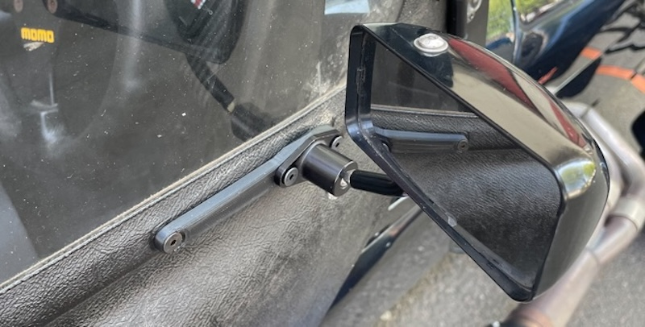

# Lifeline Mirrors and adaptors 

## The Problem.
* Caterham's mirrors are terrible. Seriously. They're enormous and because they're not convex, you can't see anything. The original Eccles mounts are only attached at the hinge so are prone to shaking because of the leverage on the 10cm long part.
* Spa Mirrors have a pretty crappy mount that is not easily adjustable without entirely removing the mirror. I do offer some friction cups that help with this, but it's still internal adjustment.
* Motamec Mirrors are not very convex at all which makes them useless, but at least have a grub-screw to tighten mirror in place. They have "Objects in the mirror are closer than they appear" written on them. They also come with very long arms which increases leverage on the mount.

## Lifeline Mirrors
They are externally adjustable, very sturdy and have short arms. The large M6 Bolt they use for stability means they won't go through the existing holes in the doors. They also come with an imperial size 4 grub screw which is absolutely tiny and no-one has the hex key for.

## My Solution
I've designed some very stiff, _articulated_ mirror mounts that can fit the myriad dimensions of holes in Caterham side-screens. they have 2 pivots and can span a large range which should fit any set of side screens. 

I've modified Convex Black Lifeline mirrors and replaced the imperial grub screws with M3 grub screws which are much bigger stronger and are a standard metric hex size.

## How much are they?
£130 including delivery for everything. Modified mirrors and adapters. 

## How do I order?
<b>-->[use this form to order](https://forms.gle/athdrwR55KYqTNVB6)<-- </b> I'll post them out. If you're happy, you send me the money, If you're not, return them.

## What comes in the kit?
* 2x black convex mirrors modified with larger M3 metric grub screws
* 2x articulated mounts
* 2x 20mm M5 countersunk bolts 
* 2x 6mm M5 countersunk bolts 
* 2x 14mm M5 countersunk bolts

## What do I need?
* 2x Side screens that have been drilled for caterham mirrors.
* 6x original nyloc nuts and washers from hinge and mirrors.

