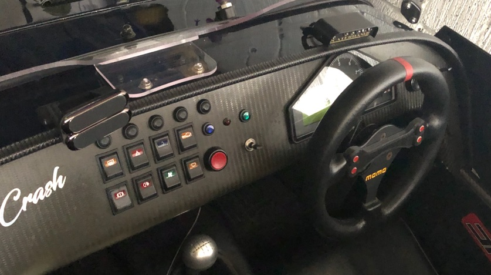

# Maglock Phone Mount

Magnetic phone mount, I use this myself, and it is VERY solid. it uses 2x magnetic phone holders stacked on top to provide total stability and a stick on steel plate on the phone case. I mount mine off-centre to be out of the way of the airflow past the aero-screen. it uses 3M VHB tape to fix to the scuttle. this can be removed cleanly using dental floss but otherwise, it is going nowhere.

Video here of what it looks like:
https://youtu.be/bOc9bqDt7ds

£20 +£3 p+p +3 for non-black colours
