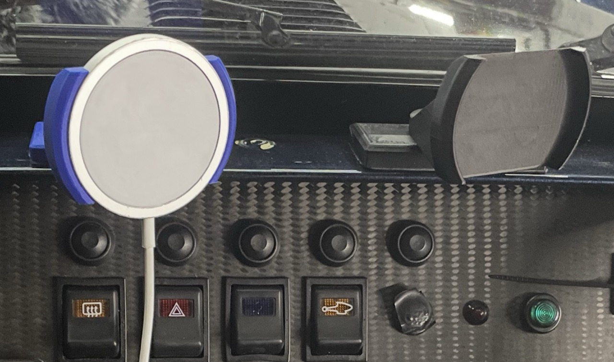
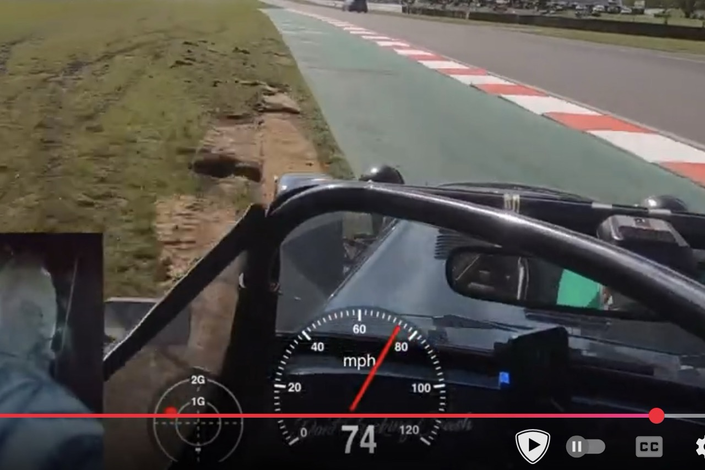

# Apple Magsafe Phone Mount

Apple Magsafe phone mount. attaches to the scuttle with M3 VHB tape. you don't need to use the poppet bolts. I have mine off-centre so that I can still use it with my aero screen (tested up to 80mph on the motorway). there are 2 versions, pivot and fixed. the pivot is slightly higher to clear the IVA trim if you still have it, the fixed will not.  

[Video here of what it looks like](https://youtu.be/33wN7WtJzs0)
Video here from the me sliding off at Oulton park and the mount holding on:

£20 for fixed
£25 for swivel
£3 extra for non-black
£3 for p&p

For any of these things please [USE THIS FORM](https://forms.gle/DpTGsNrgPXGaVSZi8) and **I can do various colours.**

