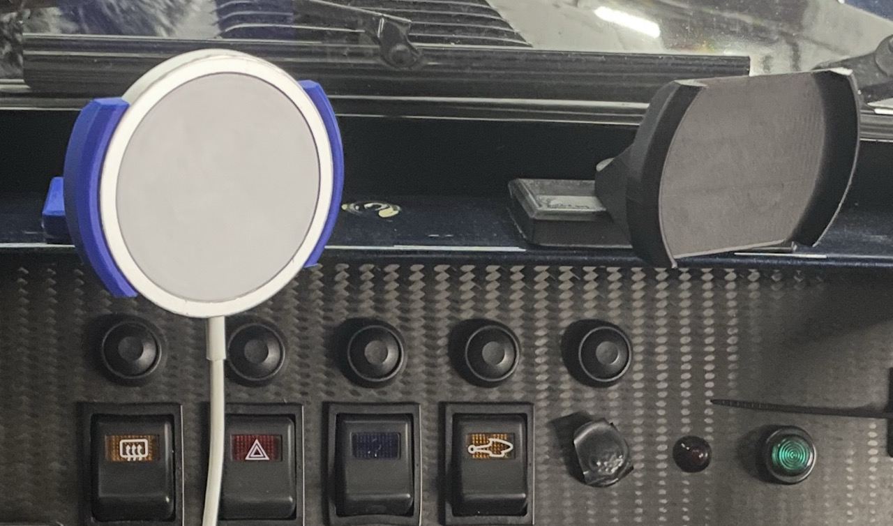
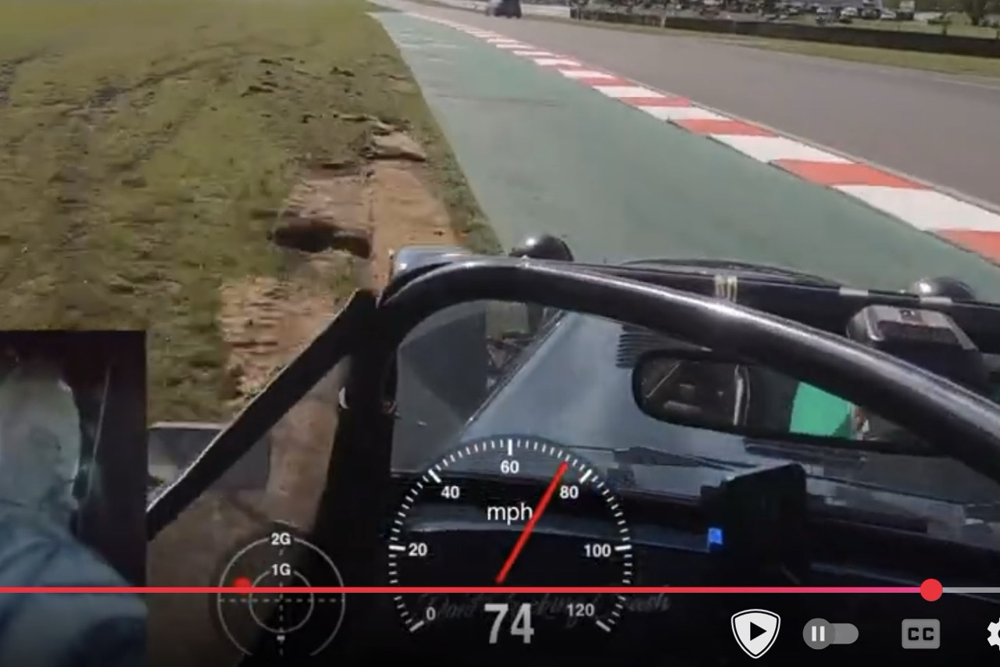

# Apple Magsafe Phone Mount

Apple Magsafe phone mount. attaches to the scuttle with M3 VHB tape. you don't need to use the poppet bolts. I have mine off-centre so that I can still use it with my aero screen (tested up to 80mph on the motorway). there are 2 versions, pivot and fixed. the pivot is slightly higher to clear the IVA trim if you still have it, the fixed will not.  

[Video here of what it looks like](https://youtu.be/33wN7WtJzs0)
Video here from the me sliding off at Oulton park and the mount holding on:

£20 for fixed
£25 for swivel
£3 extra for non-black
£3 for p&p

I can probably supply a decent (non-apple branded) magsafe charger as well. ask about this.

<button onclick="checkout(this, 'PRICE_ID_PLACEHOLDER_FIXED')">Buy Fixed – £20+P&P</button>
<button onclick="checkout(this, 'PRICE_ID_PLACEHOLDER_SWIVEL')">Buy Swivel – £25+P&P</button>

