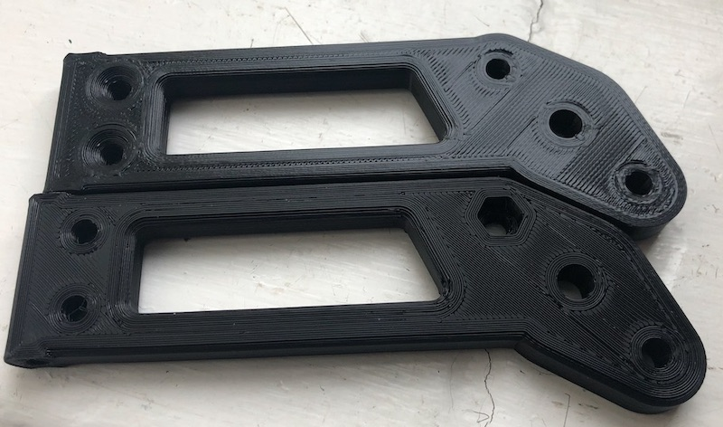

# Custom Mirror Mounts

## The Problem.
Caterham's mirrors are terrible. Seriously. They're enormous and because they're not convex, you can't see anything. The original Eccles mounts are only attached at the hinge so are prone to shaking. 

## My solution
My mounts take Spa or Motamec convex mirrors, which means you can change lane without just guessing if you're going to die.

The mounts use the same hinge design as the Eccles mounts, but with the **third bolt, which hooks into the previously drilled hole that your standard Caterham mirrors** mounted into. This creates much, much more stiffness than the original mounts and stops the vibration of the mirror.

There is also an access hole so that you can access the tightening screw for the Spa mirrors.

As all holes drilled for Caterham mirrors are different, all the mounts need to be unique. Left side, right side, both different and custom.

## How much are they?
**£60+£6, but you pay me after you're happy**. I'll make them, send them out, fix any problems, and then you pay.

## Are they any good?
I've been running them for a few months now and have done >2000 miles including 3 track days and no problems. I've sold a few and everyone has paid! 

Video here:

## Are they strong enough?
Yes. They're much stronger than you'd think. I've snapped one, but it took a bench vice and a hammer. They look like this inside:

## What do they look like?
These are 3D printed, so they typically look like this:

The back side (bottom in this picture), often has some small irregularities, but this is the face that you don't see. The front side has a pattern from the printing which you can make out in bright light.

## How do I order?
The instructions are in the form.  
<b>-->[use this form to order](https://forms.gle/tmJhrhNtBkxiYoQS9)<-- </b> I'll post them out. If you're happy, you send me the money, If you're not, you return them.

## What comes in the kit?
* 2x custom mounts
* 4x 20mm M5 countersunk bolts for the hinge attachment
* 2x 25mm M5 countersunk bolts for the bottom attachment
* 2x 14mm M5 countersunk bolts for the mount-mirror bolt

## What do I need?
* 2x Spa/Motomec/CBS mirrors (buy the convex spa ones [here](http://www.kitcardirect.co.uk/spa-formula-f1-mirror.html) or the motamecs [here](https://www.motamec.com/motamec-racing-formula-f1-car-wing-mirror-x2-convex-glass-swivel-mount-black.html )
* 2x Side screens that have been drilled.
* 2x original Caterham brass door hinge pivots (just gently tap them out of the existing pivots by the pointy end. The end that is inserted is knurled, or you can get them [here](https://caterhamparts.co.uk/fittings/599-wind-protector-hinge.html) or [here](http://www.kitcardirect.co.uk/shop-kit-car/weather-protection/wet-weather-side-door-hinges-each.html))
* 8x original nyloc nuts and washers from hinge and mirrors.

## How do I fit them?
* Open 1 beer (Your choice. My preference is something hoppy like a Siren or a Landlord)
* test fit mounts, just drop the bolts through and check it all lines up. if a mistake has been made, this is the time to find out.
* unscrew lower hinge from screen.
* tap out brass hinge pivot (it's knurled on the end that is inserted) by putting the hole above a gap in a vice or on the edge of a bench and tapping it out by the pointy end. 
* take brass hinge pivot and tap it into your new mount. it goes in smooth, pointy end first and should grip onto the knurled end.
* don't tap it in upside down!
* With the screws inserted, offer up the Spa mirror to the car and set the angle of the mirror correct.  
* once mirror is perfect, tighten the spa mirror down hard and the bolt mount to side screen with your nyloc nuts.
* enjoy worrying that now your rear-view mirror vibrates more than your wing mirrors.
* enjoy ignoring everything behind you anyway.

## Do you do different colours from black?
Yes! for £5 more I can do a colour that I have filament for (currently Orange, Red, Green, Grey, Blue). I can do others but cost will be more. I'm not guaranteeing colour tone.

## Can I use either Motamec or Spa mirrors
Yes, although I personally think the Spa mirrors are better as they're more convex and a little stiffer (comparison [here](https://www.caterhamlotus7.club/forum/techtalk/motamec-vs-spa-mirrors-0)). they are a bit more finicky to fit and adjust though.
I don't supply bolts correct for the Motamecs as I don't think they're as good (although I do have them on my car at the moment), but bolts are easily sorted. 

## What if you think they're rubbish?
cut them in half with a saw, send me a photo them, I'll not ask you for any money.

**Any questions or anything else, contact me 7@naughtyserver.com**