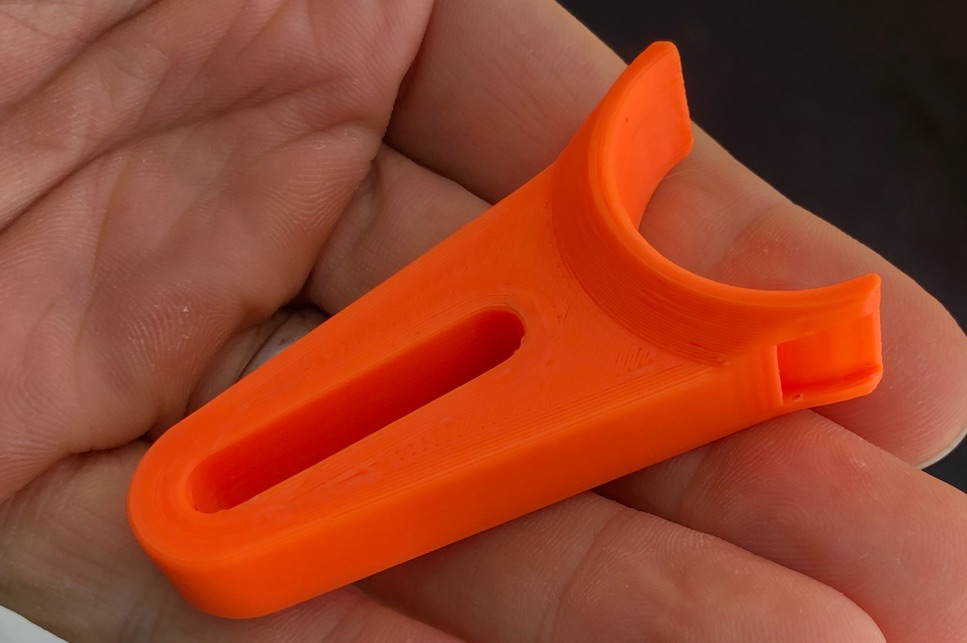
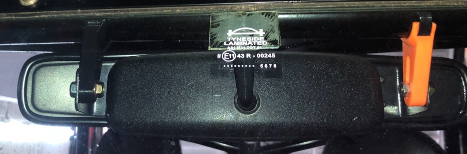

# Motorsport Mirror Mounts (rollcage mounted)

These are for attaching your rollcage mirror (longacre or similar) to your rollcage.
Included is 3 mounts, 2 large, 1 small, a pair of jubilee clips and rubber covers to stop the jubilees from scratching the powdercoat. slot range is around 30-65mm. 
cage tube size is 32mm or 38 

They look like this, this one is in orange so you can see it!
 

[Video here of what they look like](https://youtu.be/YTZIwV7VNT0)

£30 delivered inc jubilees

<button onclick="checkout(this, 'PRICE_ID_PLACEHOLDER')">Buy – £30 delivered</button>

