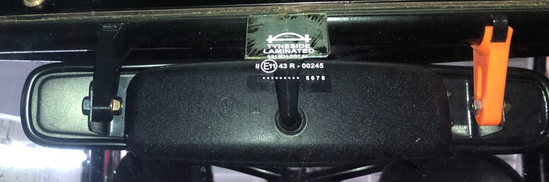

# Motorsport Mirror Mounts (rollcage mounted)

These are for attaching your rollcage mirror (longacre or similar) to your rollcage.
Included is 3 mounts, 2 large, 1 small, a pair of jubilee clips and rubber covers to stop the jubilees from scratching the powdercoat. slot range is around 30-65mm. 
cage tube size is 32mm or 38 

They look like this, this one is in orange so you can see it!
 

[Video here of what they look like](https://youtu.be/YTZIwV7VNT0)

I've also designed some to mount directly to your windscreen using 3M VHB 

£30 delivered inc jubilees 

To order [USE THIS FORM](https://buy.stripe.com/28EeVc5OT1Kf7Rs3fTbQY08) and **I can do various colours.**

