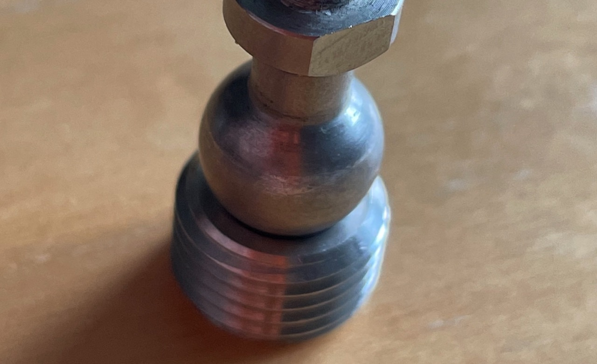
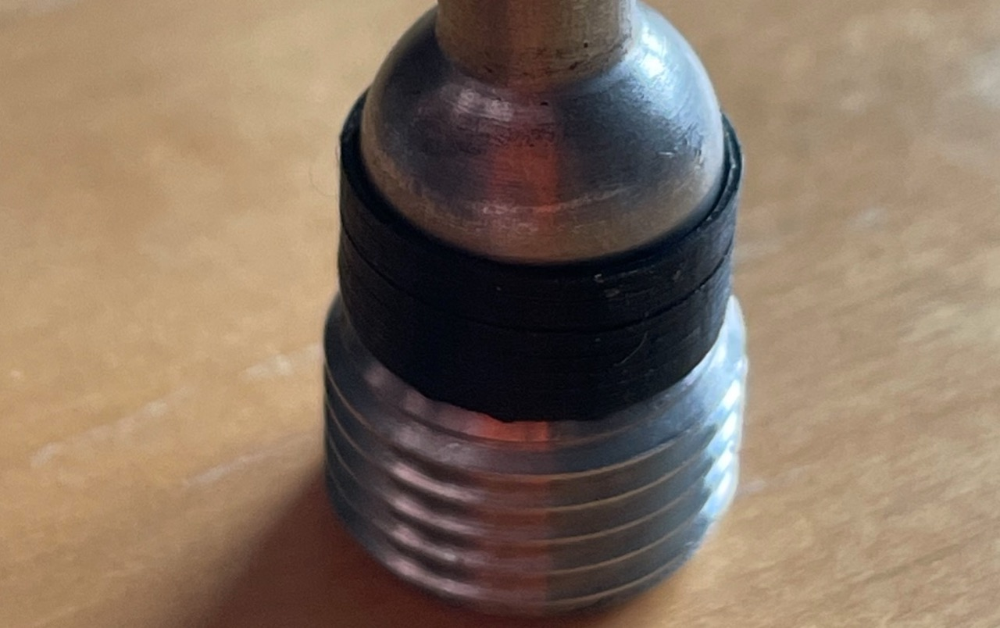
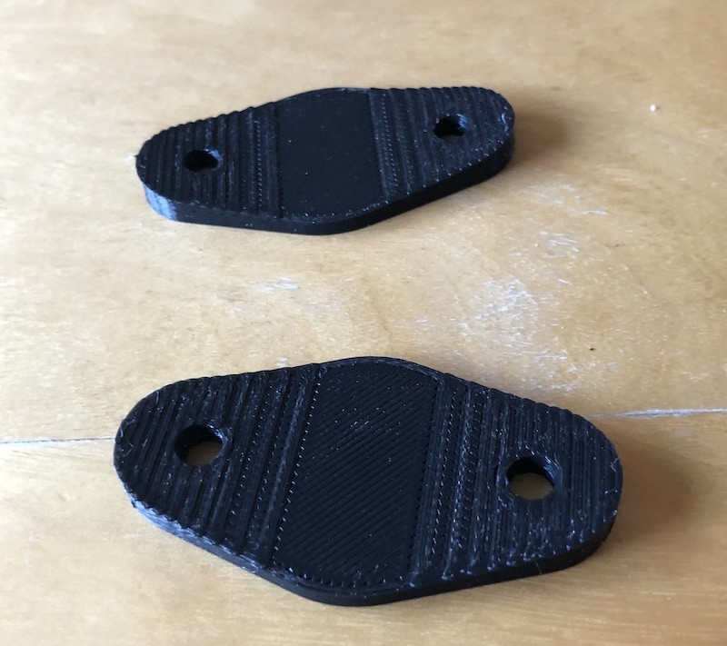
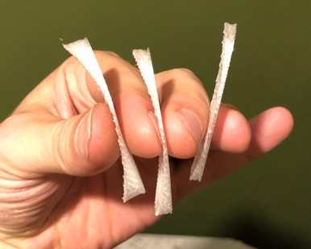

# Aeroscreen Stuff

delivery for all these things is £3, so if you've ordered something else, p&p is included 
For any of these things please [USE THIS FORM](https://forms.gle/DpTGsNrgPXGaVSZi8) and **I can do various colours.**

## Increased friction fit for spa mirrors
from 0.00005mm^2 contact
 
to 10000m^2 contact (lol)
 
These fit into the crappy Spa and Motamec sockets to increase friction and adjustability 
£12 or free with any of my mirror mounts

## Curved shims for Aero Screen mirrors
 
 
Fitting flat metal mirror brackets to a curved screen doesn't work without putting undue stress on the screen. A selection of these shims relieves that stress. available in black or white 
2 pairs in different curved profiles 
£12

