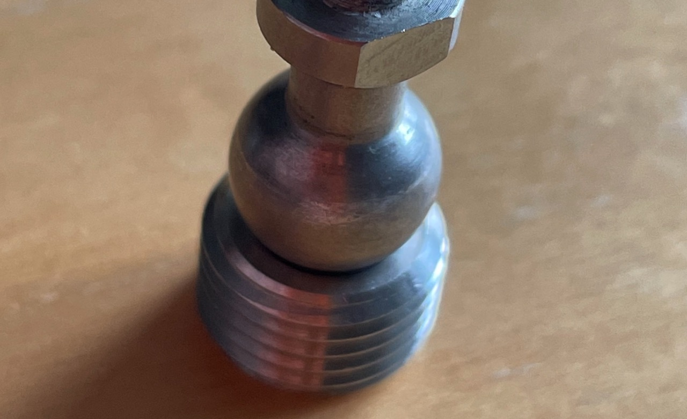
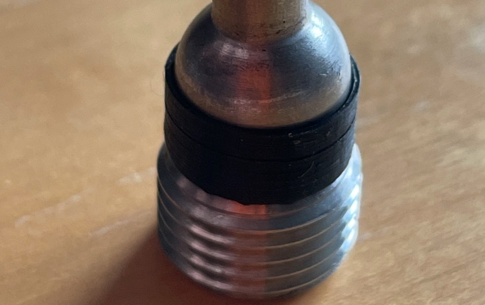
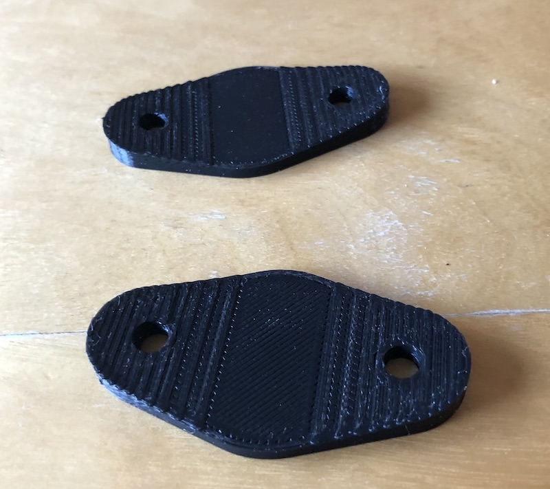
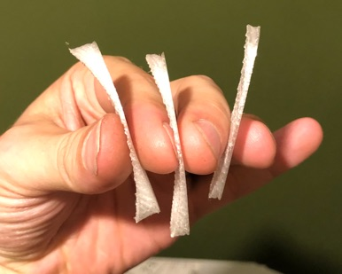

# Aeroscreen Stuff

All prices + £3 P&P

## Increased friction fit for spa mirrors
from 0.00005mm^2 contact
 
to 10000m^2 contact (lol)
 
These fit into the crappy Spa and Motamec sockets to increase friction and adjustability 
£15 + £3 P&P (or free with any of my mirror mounts)

<button onclick="addToBasket('price_1TIxqLAhb23PF7gKoRjh9Pqu', 'Friction Cups', 15)">Add to basket – £15 + £3 P&P</button>

## Curved shims for Aero Screen mirrors
 
 
Fitting flat metal mirror brackets to a curved screen doesn't work without putting undue stress on the screen. A selection of these shims relieves that stress. available in black or white 
2 pairs in different curved profiles 
I can make them with the curve lengthways like in the photos, or widthways (be sure to mention which you want)
£15 + £3 P&P

<button onclick="addToBasket('price_1TIxqMAhb23PF7gKdV9QFq2D', 'Curved Shims', 15)">Add to basket – £15 + £3 P&P</button>

