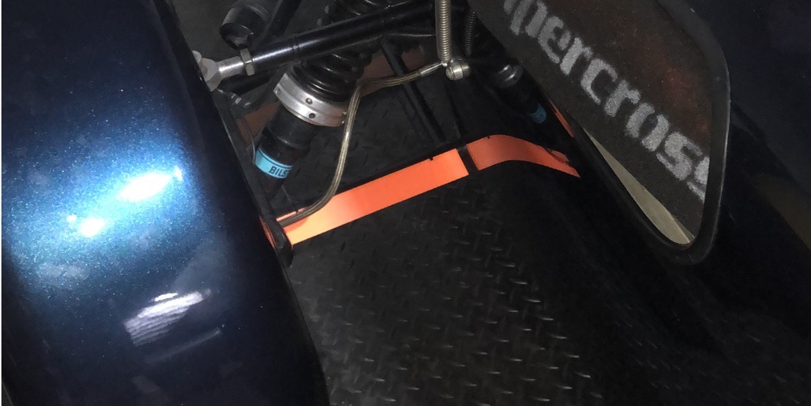

# Stuff

delivery for all these things is £3, so if you've ordered something else, p&p is included 
For any of these things please [USE THIS FORM](https://forms.gle/ER4xNpb1KJiYwWG29) and **I can do various colours.**

## Darth Schrader:  
_"I find your lack of dust-caps disturbing"_ 
  
I HATE dust caps that you have to screw on your fingers get filthy so I just chuck em. These are push fit so miiiiiiiles better and 
 
£10

## Increased friction fit for spa mirrors
from 0.00005mm^2 contact
 
to 10000m^2 contact (lol)
 
These fit into the crappy Spa and Motamec sockets to increase friction and adjustability 
£7 or free with any of my mirror mounts

## Curved shims for Aero Screen mirrors
 
 
Fitting flat metal mirror brackets to a curved screen doesn't work without putting undue stress on the screen. A selection of these shims relieves that stress. available in black or white 
2 pairs in different curved profiles 
£7

## Ziptie Gopro Mount
 
fixes to rollbar/cage using a reusable Ziptie and a bit of rubber. 
32mm (rollcage) and 38mm (rollbar) 
£7

## Wheel Hook
 
the hook is designed to perfectly fit the standard Momo Caterham wheel so you can hang it somewhere out of sight. 
£5

## "Aero" trailing edges
 
I did these for a bit of a laugh but I actually quite like the look of them. 
fixed on with zipties and/or doublesided tape.
provide 100kg of downforce at 140mph* 
£15 

