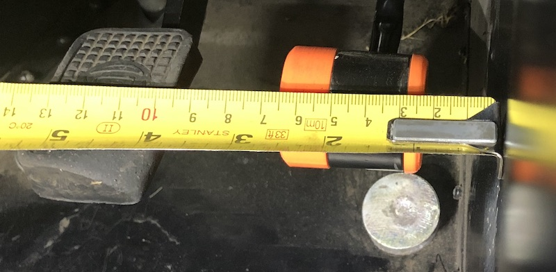
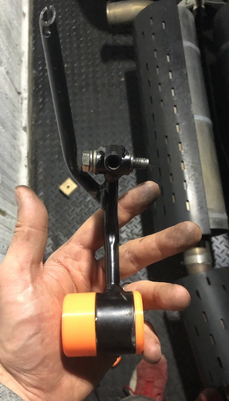

# Pedal Extensions

3D printed plugs with brass threaded inserts that will fit into your Caterham's pedal to make it wider so that you can more easily "heel and toe". This is especially difficult in SV chassis cars where the gap can be up to 75mm.

I supply a 8mm plug unthreaded on the right side, and two of 10, 15 or 20, 25, 30 mm extension plugs with brass threaded inserts on the left to tune the gap.

In my S3 chassis I have a 50mm gap in which I use a 15mm plug and in my size 8 driving boots, it's perfect. 35mm seems pretty good to me and is about 1/3 of the width of my foot.

I also do a bigger version which [makes heel-and-toeing even easier](/large-pedals) 

## how do I order?

what is the distance between your brake and your accelerator?  

* for an S3 chassis, 90% of people are happy with a 10-15mm plug so I'll send you a 10 and a 15.
* for an SV chassis it is more variable. you need to tell me what you want and I'll send you a 20 and a 30 or something similar. 

## How much are they?
£35 delivered for 2 sizes + £5 for extra sizes

## To order, [Use this Form](https://buy.stripe.com/cNieVcelp0GbefQ7w9bQY01)

## Fitting
* Fit the cap into the right hand side of the pedal (gogo-gadget arms help here)
* fit the main part of the pedal to the left side, slide the bolt into it.
* squeeze the pedal together and slide the bolt in.
* tighten the bolt. once you hear cracking noises, stop. it should be very firmly fit now. if not, tighten some more.
* if it doesn't go together you could use something to squeeze it together like an irwin grip or big channel pliers.
* if this doesn't work you may need to remove the pedal which isn't a difficult job but will add a good half hour. the pedals sometimes ovalise with use and need a mallet to get the plugs into it. if you damage a plug fitting it, just get in touch and I'll send you another.
NB. All pedals on Caterhams are _slightly_ different so you _might_ need 5 minutes of filing for it to fit.

 

### FAQ

- How strong is it?
  - Strong enough. You're not driving a transit van in steel toecaps, you're wearing ballet shoes. they're printed with a honeycomb infil (look above) and 6 layers of PLA walls. tap them, they sound high pitched cos they're so stiff.
- What happens if it snaps and I crash my car
  - This product is used entirely at your own risk. again, it's not your brake pedal.
- I think it's rubbish, I want my money back.
  - OK, send it back and I'll refund you.
- Do I need to bolt it? Will it friction fit?
  - Maybe. I suspect a bit of superglue or epoxy would fix it in place as the plugs have deep insertion but I haven't tried this.
- What size do I get?
  - measure your gap between the pedal. I _estimate_ it should be around 35-40mm get a plug that fits to that
- will they melt?
  - no. they're made of PETG which softens at 100degC so your car would need to be on fire and this will be the least of your problems 
- I want to give you some feedback
  - please do! just email me at john@uberniche.co.uk

### Some example pictures here:

#### destructive testing meant I added the slots to make them stronger.

saying that, I've never had anyone break any as far as I'm aware.

#### S3 chassis with 15mm adapter reducing 50mm gap to around 35mm

####  S3 chassis with 15mm adapter reducing 50mm gap to around 35mm

#### Some video (click it) of heal & toe action

### Some Happy Customers' pedals

 
 
 


