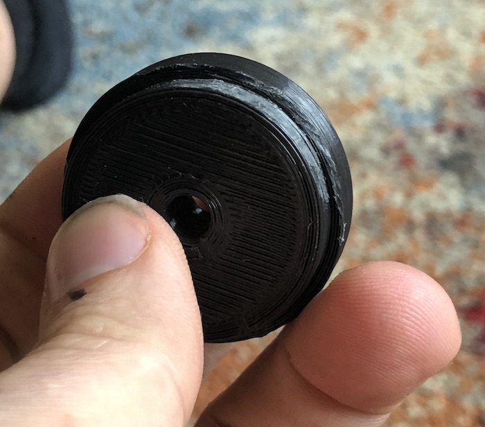

# Pedal Extensions

## What are you selling?
3D printed plugs that will fit into your Caterham's pedal to make it wider so that you can more easily "heel and toe". This is especially difficult in SV chassis cars where the gap can be up to 75mm.

I supply a 5mm plug on the right side, and two of 10, 15 or 20, 25, 30 mm extension plugs on the left to tune the gap.

In my S3 chassis I have a 50mm gap in which I use a 15mm plug and in my size 8 driving boots, it's perfect. 35mm seems pretty good to me and is about 1/3 of the width of my foot.

## how do I order?
first, look at your pedals.
is it like the old style  
 
or the new style  
 

what is the distance between your brake and your accelerator?  

* for an S3 chassis, 90% of people are happy with a 10-15mm plug so I'll send you a 10 and a 15.
* for an SV chassis it is extremely variable. you need to tell me what you want and I'll send you a 15 and a 25 or something similar

## How much are they?
£35 delivered

## For orders, please [Use this Form](https://forms.gle/UBwf8uiUNVjn1jJa9)
any problems email john@uberniche.co.uk

## Fitting
**Firstly, this is easiest with the pedal off:**
* Undo the top of the pedal box (6 screws and one bolt (on mine))
* Detach the throttle cable
* Undo the bolt of the accelerator pivot (13mm open spanner)
* Remove pedal
* Congratulations, you've not dislocated your shoulder like you will trying to do this with the pedal on the car.
   
  
   
  NB. All pedals on caterhams are _slightly_ different so either I get you to measure your pedal with a set of calipers or I send you a plug that _might_ need 5 minutes of filing for it to fit.

**Fit the plugs into the pedals**
* If you struggle getting them in, try spinning them a bit. the plugs are slightly oval as many pedals are oval.
* If they still won't fit, find the spot where they almost go in and then file a little off the widest part of the insertion part on opposite sides of the plug like this:
   
  
   
* (note the printing pattern of the part is not indicative of the wide bit)
* First press the 10/15/20/etc extension plug into the left side. This should go in with a bit of a shove. If you have the (S3) 15mm and 10mm, try the 15mm as that's what I'm using.
* Press fit the 5mm/10mm plug into the right hand side. This should go in with a bit of a shove. Most of these I sent out are round so should fit easily
* Once they're both in, put the bolt through the 5mm, apply some loctite and then tighten down finger tight. Don't overtighten it, the bolt just needs to hold it together not take any stress. if you hear cracking noises you're tight enough (this is fine). 

**Refit your pedal**
* Same but in reverse. Refitting the throttle cable can be easier if you relieve the tension from the throttle body.

### FAQ
- How heavy are they?
  - 24g with a steel bolt. even less if you buy a Ti bolt. even less if you epoxy it in.
- How strong is it?
  - Strong enough. You're not driving a transit van in steel toecaps, you're wearing ballet shoes. they're printed with a honeycomb infil (look above) and 6 layers of PLA walls. tap them, they sound high pitched cos they're so stiff.
- What happens if it snaps and I crash my car
  - This product is used entirely at your own risk. again, it's not your brake pedal.
- I don't want to take my pedal out.
  - If you cut down an allen key you can just about get in there to fit it. I've done it twice, but it's a pain in the shoulder. Seriously, just take the pedal out for the fitting.
- I think it's rubbish, I want my money back.
  - OK, send it back and I'll refund you.
- I want a custom colour.
  - OK. It'll cost you another £5
- I want a custom size width or height
  - OK. It'll cost you another £5
- How tight do I make it?
  - Not very. Tweak it up a bit, if you hear cracking noises, stop!
- Do I need to bolt it? Will it friction fit?
  - Maybe. I suspect a bit of superglue or epoxy would fix it in place as the plugs have deep insertion but I haven't tried this.
- What size do I get?
  - measure your gap between the pedal. I _estimate_ it should be around 35-40mm get a plug that fits to that
- How eco-friendly are they?
  - apart from the fact your car runs on fermented dinosaurs... the plastic itself is plant-based, renewable and it is eventually biodegradeable. The bags I use are 100% recycled and recyclable. the delivery man runs on pies.
- I want to give you some feedback
  - please do! just email me at john@uberniche.co.uk

### Some example pictures here:

#### S3 chassis with 15mm adapter reducing 50mm gap to around 35mm

####  S3 chassis with 15mm adapter reducing 50mm gap to around 35mm

#### Some video (click it) of heal & toe action



### Some Happy Customers' pedals

 
 
 
