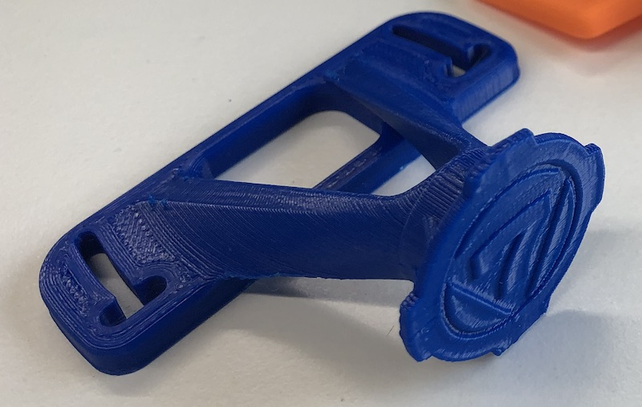
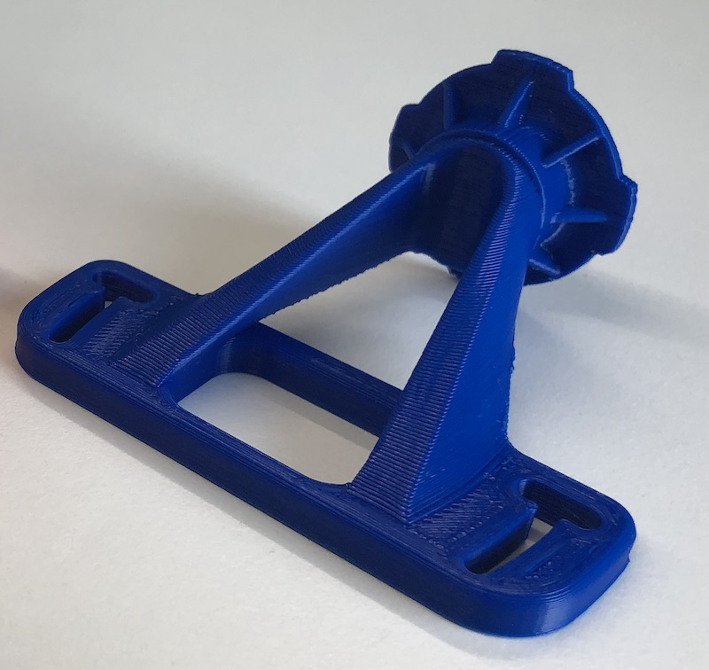

# Quadlock

* Original was a Collaboration with [Chris Leete](https://www.instagram.com/chrisl3ete/) on the design.
* V2 my redesign for easier and stronger printing.
* Printed in PLA to be tough and stiff.
* Slots for fitting a range of bolt dimensions in the scuttle panel and allowing rotation. they are around 57-69mm 
* Or blank (not winkie shaped slots, seriously Chris....) for using VHB tape (my preference).

Please be aware, solidly mounting phones to vehicles can damage them. I've heard of camera stabilisation being destroyed by attaching them to motorbikes. I do know Chris has been using his for a year. 

V2 
£16+ £3 p+p +3 for non black colours

To order, click [here](https://forms.gle/DpTGsNrgPXGaVSZi8)

