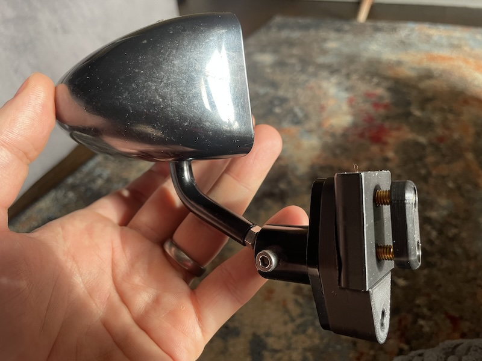
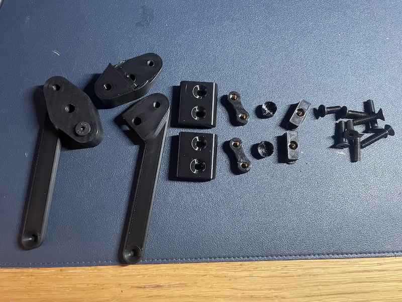

# Quick Swap Windscreen Mirror Mounts

## Driving with a windscreen but without sidescreens
A couple of people asked me if I could supply mounts that would attach to the side of the windscreen so that when they're running with halfdoors/no doors they can use spa mirrors. I had a bit of a think and figured out I could create some mounts that would attach to the hinge that the sidescreen would fit into, and also be able to be attached to the sidescreen!

## How to fit:
Youtube video:

The hinge has the normal geometry so that sidescreens fit into it as usual. it replaces one of the hinges on the windscreen. it comes with a captive nut holder so that you don't need a spanner to swap the mirror/door. 

The mirror bracket clips into the bottom of the hinge and then bolts through the bracket, hinge and windscreen stanchion to hold it all together nice and strong. all the weight is held by the steel bolt. 

The sidescreen bracket accepts the mirror carrier and then bolts through the bracket and the sidescreen to hold it all together nice and strong. all the weight is held by the steel bolt. it comes with a wingnut so that you don't need a spanner to swap the mirror out.

to swap back, simply remove the longer screw, unclip the mirror and replace the short screw.

all screws are included and are black, not the Titanium ones shown in the video.

## How much are they?
**£50 delivered, but you pay me after you're happy**. I'll make them, send them out, and then you pay. 
if you don't need hinges (as you got them with my mirror adapters) it's 10 off.
if you don't want the sidescreen brackets, it's £35 delivered.

To order [USE THIS FORM](https://forms.gle/DpTGsNrgPXGaVSZi8)

## What comes in the kit?
* 2x sidescreen brackets (optional)
* 2x mirror adapters
* 2x hinges (stop the sidescreens from opening too much and resting on the mirrors ) these can be mounted either top or bottom
* 2x 'captive nuts'
* 2x friction shims for spa mirrors
* 2x wingnuts
* 4x 20mm M5 countersunk bolts for the hinge attachment
* 2x 30mm M5 countersunk bolts for the sidescreen bracket
* 2x 16mm M5 countersunk bolts for the sidescreen bracket

## What do I need?
* 2x Spa/Motomec/CBS mirrors (buy the convex spa ones [here](http://www.kitcardirect.co.uk/spa-formula-f1-mirror.html) or the motamecs [here](https://www.motamec.com/motamec-racing-formula-f1-car-wing-mirror-x2-convex-glass-swivel-mount-black.html )

## Can I use either Motamec or Spa mirrors
Yes, although I personally think the Spa mirrors are better as they're more convex and a little stiffer (comparison [here](https://www.caterhamlotus7.club/forum/techtalk/motamec-vs-spa-mirrors-0)). they are a bit more finicky to fit and adjust though. you'll need to countersink the bolt holes on your motamec mounts for the bolts to be the right length.


