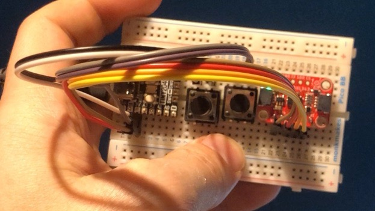
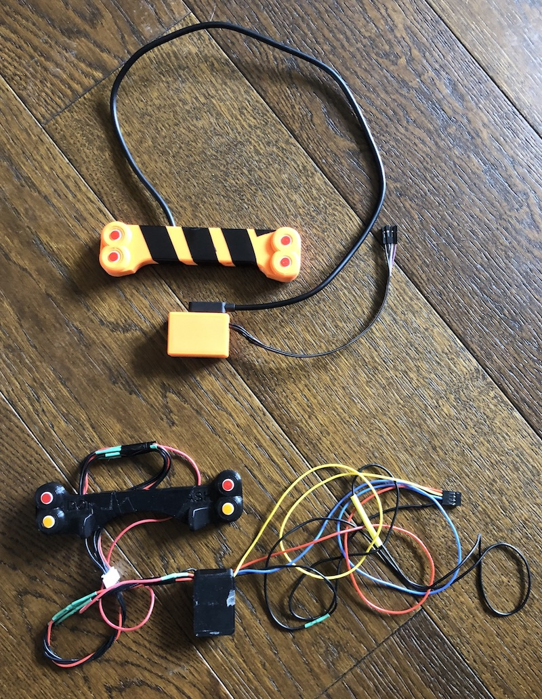
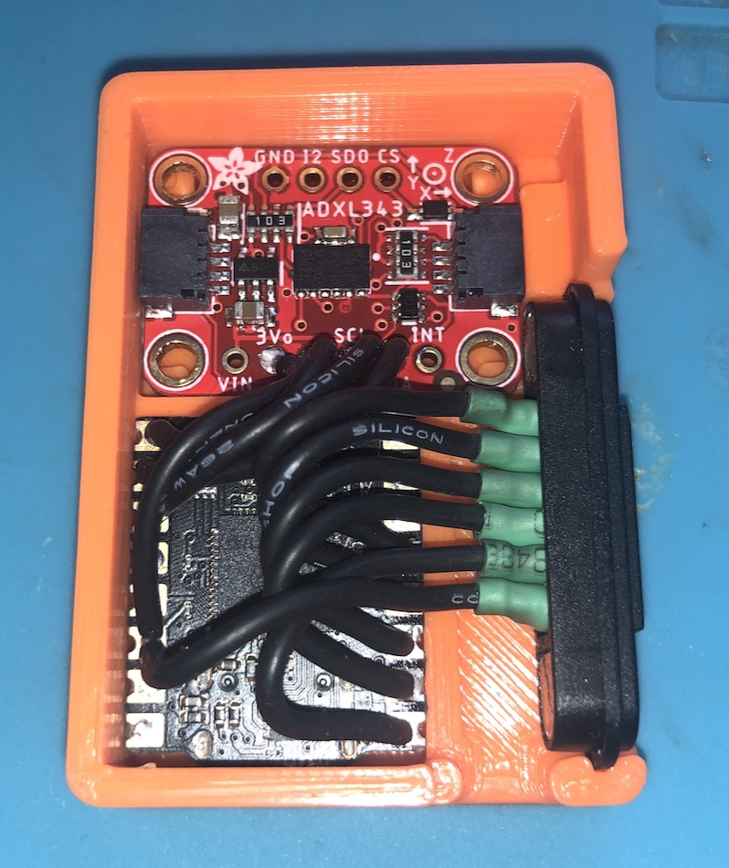

#Self Cancelling Indicators

I totally HATE the indicating system on the Caterham. I was forever forgetting to stop the indicator and it was just a matter of time before somebody pulled out on me as they thought I was indicating to turn before them. 

so I had a bit of a think and came up with an idea. 

* an accelerometer to understand when the car was cornering or not 
* some buttons on the wheel to turn indicators on/off
* a microcontroller and some logic for handling the on/off state and self-cancelling
* an interface with the car

First off, I'm a software developer and so I know _just_ enough to be dangerous with technology. I knew nothing about electronics, hadn't ever used a microcontroller and didn't really know how to do any of this. all of my knowledge came from my advanced knowledge of using google and youtube :D. 

my first prototype was a breadboard board with some buttons

this meant that I could proof-of-concept the integration of some buttons, accelerometer and the Tiny2040 microcontroller. this was about 50 lines of python at this point.

next was adding buttons with LEDs in to control and get some feedback on the wheel. This was where I first ran into my total lack of knowledge about how electricity works. I kept melting LEDs, either on the breadboard or the LEDs in the buttons (which are relatively expensive). it took a while to be able to figure out that I needed some resistors. then I had to think about where to put it all and power it. the original plan was the steering wheel, but I realised pretty quickly that wouldn't work, so the first cut was a box taped the dash connected to the wheel with loads of cables as seen below, here.

it was pretty horrible but it proved it could work. connecting it to the car was the next hurdle. after a few false starts (lots of fuses blown) trying to use mosfets and transistors, my friend Timur brought a relay over, and we got it working for the first time. from there I replaced the relay with some opto-coupler relays which totally disconnect the car from the electronics. I then packaged it all a bit better using a really nice maglock connector (like on your macbook) for the removable wheel, as can be seen above. it all wires into the existing indicator switch and piggybacks off the spade connectors so that if there si a problem, the original indicator still works and it's easily disabled as it's powered off a 5v usb.

once I got it all working, it was time to try the self-cancelling part out. this involved lots of driving around the local streets in a loud caterham with a laptop recording a video of me and the graph of what the accelerometer was reporting and the state changes of the indicators. this took a hours to get right. sitting at the side of the road, programming python gets some odd looks from people and a few people asking what I was doing and what kind of car it was, etc "programming my indicators, a caterham, no it's not a racecar, not as expensive as you think". the indicators now turn off once the car is straightening out. it's a little affected by the camber of the road as well so "straight ahead" has to be a little generous.

with all this working, I printed a new box for the controller and a new case for the buttons, soldered it all up and slapped it all back on the car. the controller now behind the dash which this is where I got my first problem with the 3D printed parts. the hot air blowing on the PLA box caused the box to warp and fall off, so I had to reprint using PETG, which is a plastic that is more tolerant to heat. I've not had any problems since. in fact, I went almost a year without touching it at all and it looks much better in black (I might do another in Blue to match the car)

the final piece of the puzzle was the windscreen wipers. I HATE having to find the button for the wipers whilst driving and the lack of intermittent wiping. I eventually managed to wire the final button into the wipers. now if you press it, it will wipe once, hold for a second, intermittent 3 seconds, hold for 2 it is 5 seconds and 3 it is 10 seconds intermittent. almost like a normal car. almost...

DONE!

if anyone is interested in this stuff get in touch. I can't sell you a fully made kit as I can't accept any liability if something goes wrong, but I could easily provide you with the parts with the software on and a wiring diagram (it is about 5 hours of soldering, not difficult, just not something I'm able to do cost-effectively) 
