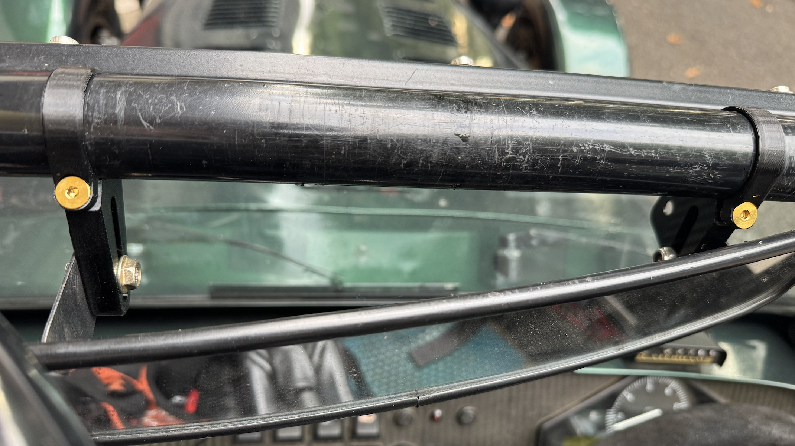
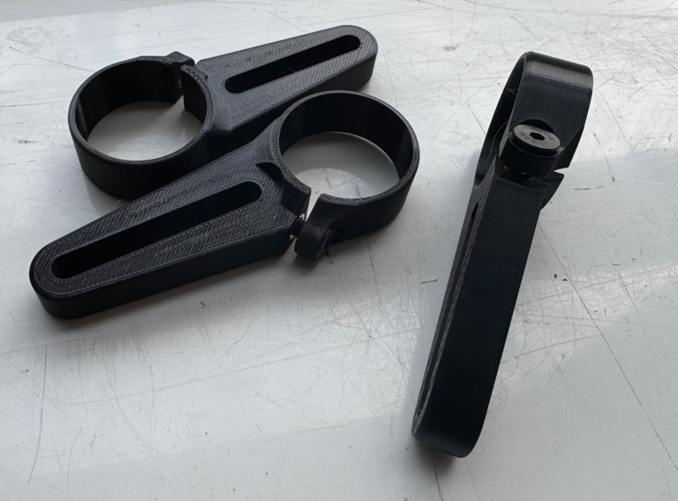

# Motorsport Mirror Mounts (rollcage mounted)

Centre Mirror mounts to hold a longacre-style motorsport mirror onto your 32/38mm rollcage.

note my gold Ti bolts aren't included, just plain blackened steel ones as here:

I've tested them at 130mph without a screen, and they fit with a hood and screen and on unlike other mounts.

made from PETG so nice, tough and UV-resistant. Flexible enough to fit around the cage and clamp down. 

£30 + £4 P&P 

32mm: 
<button onclick="addToBasket('price_1TM6pAAhb23PF7gKJ82lsWeD', 'Rollcage Mirror Mounts', 30, '32mm')">Add to basket – 32mm – £30 + £4 P&P</button>

38mm:
<button onclick="addToBasket('price_1UAylPAhb23PF7gKDwZFmv6h', 'Rollcage Mirror Mounts', 30, '38mm')">Add to basket – 38mm – £30 + £4 P&P</button>

